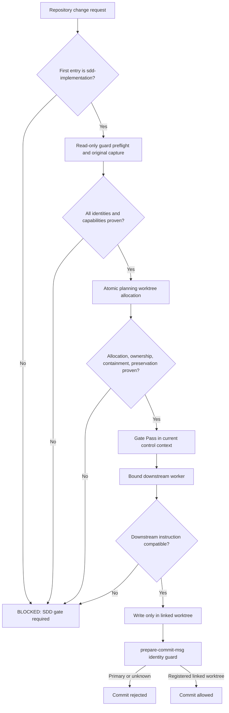

# SDD fail-closed worktree gate 仕様

> [!success] Human-approved canonical specification
> Human / repository maintainer は 2026-08-14 に本書を Written Spec として
> 明示承認した。承認済み substantive decisions を変更せず、active canonical
> synthesis として昇格した。

## Status

- current status: `accepted` / `active`
- canonical identity: `knowledge/wiki/syntheses/sdd-fail-closed-worktree-gate-spec.md`
- decision: `promote`
- decision actor: Human / repository maintainer（Canonical Owner）
- decision date: `2026-08-14`
- decision reason: Human が Written Spec として明示承認したため
- approved decision: repository change の入口を `sdd-implementation` に一本化し、最初の
  repository write より前の gate と accidental commit の secondary guard を
  ともに fail closed にする
- provenance: Research Report
  `.superpowers/research/sdd-fail-closed-worktree-gate/research.md`、repo-owned
  `skills/sdd-implementation/`、既存の
  [[wiki/syntheses/sdd-first-write-worktree-migration-spec|SDD first-write worktree migration 仕様]]
- promoted source: [[wiki/drafts/sdd-fail-closed-worktree-gate-spec|SDD fail-closed worktree gate 仕様（昇格済み draft）]]

## Canonical relation and lifecycle boundary

本仕様は
[[wiki/syntheses/sdd-first-write-worktree-migration-spec|SDD first-write worktree migration 仕様]]
を supersede せず、First-Write Gate の **normative fail-closed addendum** とする。
既存 canonical spec は original-checkout capture、planning worktree allocation、
binding と unrelated Epic adapter を引き続き所有する。本仕様では、repository-change first-entry precedence、
relevant failure の no-fallback semantics、guard preflight / activation / commit
behavior について本 addendum を優先する。promoted draft は lifecycle evidence
として保持し、active canonical identity を重複させない。

Human approval に基づく llm-wiki promotion write set と implementation write set は
混在させない。

- **Promotion sync set:** draft lifecycle を `promoted` に更新し、canonical
  synthesis を作成し、`knowledge/index.md` に active canonical relation を一件
  登録し、`knowledge/log.md` に `draft-review` / `promote` event を追記する。
- **Implementation set:** repo router、SDD contract、guard source/activation
  interface、tests/validators だけを変更し、draft、canonical synthesis、index、
  log の lifecycle write を含めない。

promotion sync set は Human approval と llm-wiki authority のもとで先に完了し、
implementation plan と code/guard diff は promoted canonical spec を参照する。

## Problem

repo-owned `sdd-implementation` は First-Write Worktree Gate を Planning
Controller より前に置き、allocation、binding、capability、ownership の失敗を
zero-write `BLOCKED` とする。一方、現在到達可能な外部 Superpowers の
`brainstorming`、`writing-plans`、`using-git-worktrees` には、gate 前の spec /
plan write、allocation 前の ignore repair commit、permission failure 後の
current-directory continuation が残る。direct subskill route が選ばれた場合、
repo-owned SDD の安全境界を通らず original/current checkout を変更できる。

現行 tests は repo-owned prose の語句と raw `git worktree add` failure を検査
するが、downstream fallback を含む end-to-end decision、permission/sandbox
failure 後の write set、direct pre-gate invocation を観測しない。また、Git
は primary checkout と linked worktree のどちらでも通常の `git commit` を
許すため、routing error が commit まで進んだ場合の secondary defense がない。

repo source、active installed copy、external plugin cache は別 owner / lifecycle
である。repo source の修正だけで active external fallback が削除されたと扱う
ことも、active cache を repository-owned canonical source として直接編集する
こともできない。

## Goals

1. repository change は、`brainstorming`、`writing-plans`、domain-modeling、
   implementation skill その他の writable subskill より前に、必ず
   `sdd-implementation` を first entry とする。
2. First-Write Worktree Gate に、original checkout capture、atomic planning
   worktree allocation、path/CWD/artifact containment、writer ownership、guard
   preflight、original-checkout preservation の authority を集約する。
3. ordinary task の allocation、permission、path、collision、ownership、
   capability、dependency、guard identity failure を、repository content、report、
   spec、plan、commit を作らず original checkout を変えない `BLOCKED` に統一する。
4. downstream instruction が current/original checkout continuation、work-in-place、
   ignore repair、別 skill/loop への fallback を要求しても、repo-owned route
   では実行不可能にする。
5. primary checkout からの accidental commit を拒否し、identity を証明できる
   registered linked worktree の commit を許す repo-managed Git guard を設ける。
6. guard の missing、unconfigured、damaged、conflicting configuration を
   read-only preflight で検出し、silent repair や automatic install を行わず
   `BLOCKED` にする。
7. normal `git commit --no-verify` では bypass できない hook point を使い、
   guard が pre-write gate の代替ではなく secondary defense であることを保つ。
8. original checkout の starting branch、HEAD、index、tracked/untracked state を
   task の開始から終了まで不変に保つ。
9. repo source completion、active installed SDD、external dependency、guard
   activation の状態を分離し、未検証の live safety を完了と報告しない。
10. explicit guard activation は ordinary task gate から分離し、全 preflight 後に
    transaction として適用する。post-mutation failure は rollback と exact prior
    state proof を必須とし、mutation が起きた run を zero-write と呼ばない。
11. guard 自身を self-host する一回限りの bounded bootstrap authority を、この
    Epic の captured tuple と registered planning worktree にだけ適用し、後続
    task の active-guard requirement へ一般化しない。

## Non-goals

- runtime scheduler、lock service、packet schema、event log、runtime snapshot、
  compatibility bridge、context telemetry、manual compaction、`CONTEXT.md`、
  `docs/adr/` store を新設すること
- external Superpowers cache や third-party installed skill を repository-owned
  canonical source とみなして直接 patch すること
- pre-write gate を Git hook だけで置き換えること
- local Git hook を malicious actor に対する tamper-proof security boundary と
  表現すること
- primary checkout の task content を stash、reset、clean、commit、copy して
  planning worktree に移すこと
- failure 後に current directory、original checkout、guessed worktree、old loop、
  alternate writable skill へ自動継続すること
- hook/config collision を自動 merge、overwrite、chain すること
- source implementation と同時に active install、plugin update、hook activation、
  push、PR、merge、release を暗黙に実行すること
- unrelated な Epic parallel adapter、issue scheduling、review loop、publication
  contract を変更すること

## Domain terms

### Repository change entry

repository content、durable planning artifact、implementation、commit のいずれかを
発生させ得る user request の最初の repository-local workflow entry。
本仕様では `sdd-implementation` だけがこの entry を所有する。

### Controlled design surface

repository change の認識から、First-Write Worktree Gate、最初の writable
handoff、planning worktree 内の commit までの repo-owned route。外部 cache
そのものは controlled surface ではないが、controlled route から呼ぶ際の
precondition と conflict precedence は repo が所有する。

### Zero-write `BLOCKED`

repository content/artifact、Research Report、draft spec、plan、source commit を
作成せず停止する結果。atomic worktree allocation に必要な Git common metadata
以外の mutation を含めない。allocation が metadata を部分的に残した疑いが
ある場合も追加 repair を行わず、exact state を報告して Human recovery まで
`BLOCKED` を維持する。この用語は ordinary repository task gate にだけ使い、
explicit guard activation transaction の post-mutation failure には使わない。

### Zero-net activation rollback

明示承認された guard activation が mutation を開始した後に失敗し、transaction
開始前に capture した hook/config inventory と rollback 後の inventory が
byte、type、mode、symlink target、config value/origin の全項目で一致した状態。
この場合の結果は `BLOCKED: activation failed; zero net clone-local state proven`
であり、zero-write とは呼ばない。一致を証明できなければ
`BLOCKED: activation incomplete` と exact changed-state evidence を返し、全
repository task を禁止する。

### Gate Pass

First-Write Worktree Gate が current control context 内で成立させる非永続の
verdict。captured original identity、allocated planning identity、resolved root /
CWD / writable paths、guard preflight、preservation comparison が同時に成立した
ことを意味する。file、token、packet、environment variable として永続化せず、
外部や過去 run から受け取らない。

### Primary checkout

Git common directory 自体を `git dir` として使う main worktree。branch 名が
`main` かどうかでは判定しない。本仕様の guard は primary checkout からの
commit を常に拒否する。

### Registered linked task worktree

primary checkout と同じ Git common directory を共有し、current canonical
toplevel、worktree-specific git dir、named branch、`git worktree list
--porcelain` の registration が一致する linked worktree。文字列 prefix や
directory 名だけでは identity を証明しない。

### Commit guard source / activated guard

commit guard source は repository に tracked される canonical executable。
activated guard は explicit setup operation が、`core.hooksPath` が全 scope で
unset かつ custom/active hook が存在しないことを証明した clone の canonical
default hooks directory に、source と同一 bytes の `prepare-commit-msg` を配置
した clone-local state である。activation は `core.hooksPath` を変更しない。

### Relevant failure

entry precedence、guard integrity、original identity、worktree allocation、
containment、ownership、required capability/dependency、downstream compatibility
のいずれかを証明できない状態。retry、guess、fallback ではなく `BLOCKED` の
対象となる。

### One-time self-hosting bootstrap authority

Human が明示承認した、この guard 自身を初めて repository source として実装する
ためだけの bounded exception。対象 identity は次の全 tuple の exact match に
限定する。

- Epic: `sdd-fail-closed-worktree-gate`
- branch: `codex/sdd-fail-closed-worktree-gate/planning`
- registered planning worktree:
  `/Users/omitsuhashi/repos/omitsuhashi/skills/.worktrees/sdd-fail-closed-worktree-gate-planning`
- creation base / captured `starting_head_sha`:
  `c370fe14de1641aa5ee30b3fa001f4d857078091`

この authority は guard activation 前に、この planning worktree 内だけで本
guard の repo source、tests、spec/plan artifacts を author、test、commit する
ことを許す。original checkout の write/commit、external cache edit、current-
directory continuation、fallback、guard activation は一切許可しない。他の
First-Write Gate checks、path containment、original preservation は免除しない。

別 Epic、別 branch/path、別 chat、別 worktree、foreign/unattributable state には
適用しない。trusted tuple を失った後に Git state または会話から再構成、推測、
reuse してはならず、その時点で `BLOCKED`。implementation/integration closeout
または別途明示された activation operation の開始のいずれか早い時点で失効する。
以後の task は verified active guard がなければ必ず `BLOCKED` を返す。

## Authority and ownership boundary

### Human / repository maintainer

- Written Spec と implementation plan を承認する
- guard activation、既存 hook/config collision の解消、active install/plugin
  update を別操作として明示承認する
- original checkout の task-relevant dirty state、foreign/stale worktree、partial
  Git metadata を解決する
- material scope、risk acceptance、live operational completion を最終判断する

### Repository router

- 全 repository change を `sdd-implementation` へ route する
- pre-gate の writable subskill direct invocation を許可せず `BLOCKED` にする
- repository instructions が applicable downstream skill より優先し、conflict
  時は SDD safety boundary を保持することを宣言する

### First-Write Worktree Gate / Planning Controller

- read-only capture、guard preflight、atomic allocation、ownership、path binding、
  first writable dispatch、original preservation comparison を所有する
- Gate Pass 前は writable worker を dispatch しない
- downstream が追加の writable setup や fallback を要求したら `BLOCKED` を
  返し、実行しない
- worker result の artifact path を再解決し、planning root 外なら受理しない

### Downstream skills and workers

- SDD が渡した bound root、bound CWD、resolved writable paths だけを使う
- allocation、fallback root、hook activation、original checkout mutation を
  自ら行わない
- binding または required capability を失った場合は `BLOCKED` を返す
- conflicting downstream prose を repository authority より優先しない

### Commit guard

- Git commit の直前に checkout identity を read-only で検査する
- primary checkout、unregistered checkout、ambiguous/damaged identity を nonzero
  で拒否する
- identity を証明できる registered linked task worktree だけを許可する
- worktree allocation、repair、routing、Human approval を行わない

### External owners and active installation

- Superpowers cache の内容と release/update は upstream/plugin owner の authority
  に属する
- `.agents` 等の active installed copy は repo source と別 lifecycle とする
- repo-owned change は external cache bytes を直接変更せず、repo route で unsafe
  precondition を unreachable / incompatible にする

## Architecture

本仕様は一つの primary preventive control を中心に、entry、composition、
secondary commit defense、verification の layers を重ねる。

1. **Entry control:** repository router が `sdd-implementation` を唯一の
   repository-change entry にする。
2. **Primary preventive control:** First-Write Worktree Gate が first write より
   前に guard integrity、capture、allocation、containment、ownership、original
   preservation を証明する。
3. **Composition control:** downstream dispatch は Gate Pass 後の bound inputs
   に限定し、conflicting fallback instruction を `BLOCKED` に変換する。
4. **Secondary accidental-commit control:** activated Git guard が primary /
   unknown checkout の commit を拒否する。
5. **Verification control:** contract tests、Git subprocess tests、fresh runtime
   forward tests が prose presence ではなく result と write set を観測する。

Git guard は first-write gate の前提条件の一つであり、gate の代替ではない。
guard が有効でも、original checkout への report/spec write は commit 前に起き得る
ため、Gate Pass 前の zero-write boundary は常に必要である。

## Components

### 1. Repository entry contract

repo-root `AGENTS.md` と `skill-architecture.toml` は次を一貫して宣言する。

- repository change family の first/default/user-facing entry は
  `sdd-implementation` 一つ
- `brainstorming`、`writing-plans`、`using-git-worktrees`、domain-modeling、
  implementation skill は SDD-owned handoff 後の supporting capability であり、
  pre-gate entry ではない
- direct pre-gate invocation は SDD へ silently switch して continuation せず、
  `BLOCKED: SDD First-Write Worktree Gate required` を返す
- repository instruction と downstream instruction が conflict した場合、
  repository entry / containment / zero-write boundary が優先する

### 2. First-Write Gate contract

既存の `skills/sdd-implementation/SKILL.md`、planning references、fresh worker
prompts は、Gate Pass の成立条件と失敗結果を同じ意味で保持する。

最低限の ordered checks は次のとおりである。

1. original checkout canonical path、named `starting_branch`、immutable
   `starting_head_sha`、staged/unstaged/untracked を区別した status、Git common
   directory、worktree registration、Epic branch/path を read-only capture する。
2. activated guard の config、location、executable state、source/installed bytes、
   self-check capability を read-only preflight する。
3. collision、foreign ownership、permission、required capability/dependency を
   check する。
4. captured SHA から planning worktree を atomic allocate する。allocation
   loser、permission/sandbox error、partial/unknown result は `BLOCKED` とする。
5. planning registration、common directory、branch、base SHA、writer ownership、
   original checkout baseline preservation を再検証する。
6. repository root、CWD、既存 writable parent、未作成 artifact の resolved
   parent + fixed basename が planning worktree 内に含まれることを証明する。
7. Gate Pass を current control context にだけ保持し、同じ bound inputs で
   writable worker を dispatch する。

check の順序を入れ替えて、guard missing 後に worktree を作る、allocation
failure 後に report を書く、path failure 後に fallback root を選ぶことを
禁止する。

#### One-time bootstrap evaluation

ordinary guard preflight が `missing/unconfigured` を返した場合でも、Planning
Controller は automatic setup/fallback を行わない。例外的に current Human-
approved bootstrap tuple が上記四 identity と exact match し、same continuing
controller/chat の trusted control context、captured-SHA creation base、current
registration、attributable planning state、original preservation をすべて証明
できる場合だけ、この Epic の source/spec/plan write を planning worktree 内で
続行できる。

bootstrap verdict は durable token/fileにせず current trusted control context
だけに保持する。identity mismatch、tuple loss、independent chat、foreign state、
activation request、scope外 artifact は `BLOCKED`。この special case を generic
guard-missing recovery、capability fallback、future migration pattern として扱わない。

### 3. Downstream composition boundary

SDD は downstream skill を temporary executor として compose できるが、
durable safety authority は移譲しない。

- downstream は worktree を選択せず、すでに証明済みの bound worktree だけを
  受け取る
- downstream の `work in place`、current-directory setup/test、pre-allocation
  `.gitignore` repair/commit は precondition conflict として実行しない
- downstream が自 contract を満たすため current/original checkout write を
  必須とする場合は `BLOCKED: downstream incompatible with SDD containment`
- required capability/dependency がない場合も main-session authoring、old loop、
  alternate skill、guessed path へ移らない
- external cache の unsafe text が将来残るか変更されるかに依存せず、この
  repo-owned precedence を tests で固定する

### 4. Repo-managed Git commit guard

guard source は tracked repository artifact とし、activated copy は Git common
directory の canonical default hooks directory に `prepare-commit-msg` として
置く。supported activation state は `core.hooksPath` が system/global/local/
worktree/command scope のすべてで unset の clone に限定し、activation は
`core.hooksPath` を設定・変更しない。これにより hook directory 切替による
existing hook-set loss を構造的に避ける。

hook point は `prepare-commit-msg` とする。local Git documentation が示す通り、
この hook は nonzero で `git commit` を abort し、通常の
`git commit --no-verify` でも suppress されない。`pre-commit` または
`commit-msg` 単独を safety guard に使わない。

guard の allow/reject predicate は次のとおりである。

1. current toplevel、absolute git dir、absolute common dir、named branch、
   canonical worktree registration を取得できなければ reject。
2. git dir と common dir が同一なら primary checkout と判定し reject。
3. git dir が common dir の worktree-specific registration に対応しなければ
   reject。
4. canonical toplevel、git dir、branch が同一 registration record と一致し、
   primary ではない場合だけ allow。
5. path prefix、`.worktrees` という directory 名、registration list の順番、
   branch 名だけでは allow しない。
6. guard は file/config/worktree を repair または mutate しない。

### 5. Guard activation and preflight

activation は SDD route の一部として自動実行しない。Human が別途明示した
`skills/sdd-implementation/scripts/activate_commit_guard.py` だけが、次の
deterministic transaction を実行できる。

#### Supported activation state

activation 前に `activate_commit_guard.py preflight` が次の complete inventory
を capture する。

1. Git common directory、primary checkout、`git worktree list --porcelain -z` の
   全 registered worktree record（path、HEAD、branch/detached、locked/prunable）。
2. common config file の canonical path、bytes/hash、mode、owner、および
   system/global/local/command scope を含む全 effective config records。
3. `include.path` / `includeIf.*.path` から読まれた全 origin、scope、canonical
   path、bytes/hash。conditional include は registered worktree ごとに evaluation
   し、適用/非適用を記録する。
4. common config の `extensions.worktreeConfig` effective value。enabled の場合は
   primary と全 linked worktree の applicable `config.worktree` path、存在状態、
   bytes/hash、mode、owner、全 worktree-scope records。disabled/unset 時に
   unexpected `config.worktree` がある場合も ambiguity とする。
5. primary と全 registered worktree それぞれの全-scope `core.hooksPath`
   records、origin、effective value、absolute/relative resolution result。
6. Git common default hooks directory、各 worktree の resolved effective hooks
   directory candidate、worktree-specific git dir の `hooks` candidate。各 directory
   の全 entryを relative path、type、mode/executable bit、content hash、symlink
   target、sample/non-sample で inventory する。
7. candidate切替で displaced/shadowed になり得る全 executable hook と全
   non-sample hook。target `prepare-commit-msg` だけでなく non-target hook も含む。
8. repository guard source の canonical path、tracked blob identity、working-tree
   bytes、mode、owner、read-only self-check result。
9. process environment の `GIT_CONFIG_*`、`GIT_CONFIG_COUNT`、
   `GIT_CONFIG_KEY_*`、`GIT_CONFIG_VALUE_*`、`GIT_CONFIG_SYSTEM`、
   `GIT_CONFIG_GLOBAL`、`GIT_CONFIG_NOSYSTEM` 等の config source override。

inventory harness は repository root と captured registered-worktree list を input
とし、各 worktree で次の commands を実行する。`--includes` parsing の nonzero、
missing origin、unreadable file は結果を補完せず `BLOCKED` とする。

```bash
git worktree list --porcelain -z
git rev-parse --path-format=absolute --git-common-dir
git config --file <git-common-dir>/config --includes --null --list
git config --show-origin --show-scope --includes --null --list
git config --show-origin --show-scope --includes --null --get-all extensions.worktreeConfig
git config --show-origin --show-scope --includes --null --get-all core.hooksPath
git -C <registered-worktree> rev-parse --path-format=absolute --git-dir
git -C <registered-worktree> rev-parse --path-format=absolute --git-common-dir
git -C <registered-worktree> rev-parse --path-format=absolute --git-path config.worktree
git -C <registered-worktree> rev-parse --path-format=absolute --git-path hooks
git config --file <registered-config.worktree> --includes --null --list
git -C <registered-worktree> config --show-origin --show-scope --includes --null --list
git -C <registered-worktree> config --show-origin --show-scope --includes --null --get-all extensions.worktreeConfig
git -C <registered-worktree> config --show-origin --show-scope --includes --null --get-all core.hooksPath
git -C <registered-worktree> config --path --includes --get-all core.hooksPath
```

`--get-all` の exit `1` + empty output は key unset として記録し、それ以外の
nonzero は failure とする。`--file <registered-config.worktree>` はその file が
applicableかつ存在する場合だけ実行し、applicableなのに missing/unreadable なら
`BLOCKED` とする。harness は command argv、cwd、exit、stdout/stderr、
config origin/scope records、environment override keys、common/worktree config
file inventories、all hook-directory inventories を一つの immutable preflight
result に束ねる。mutation直前に同じ commands/inventory を再実行し exact match
を要求する。

supported candidate は、全 registered worktree で `core.hooksPath` が全 scope
unset、environment overrideなし、`extensions.worktreeConfig` と全 applicable
worktree config を完全に読め、default/common hooks directory が一意かつ全
worktreeで同一、standard non-executable `*.sample` 以外の custom/non-sample/
executable hook がなく、target absent の場合だけである。

missing registration、unreadable include/conditional include、ambiguous origin /
scope、unknown/missing applicable worktree config、relative/unknown hooksPath
resolution、custom hook、candidate hook directory不一致、complete effective hook
setを証明不能のいずれかは pre-mutation `BLOCKED` とする。

この最小 model は existing hook の composition/chaining を行わない。custom
hook、active non-target hook、custom `core.hooksPath` が一つでもあれば Human が
complete effective set の保存方法を別途明示するまで停止する。activation 自身が
解決案を推測、disable、overwrite してはならない。activation candidate が
existing hook を silently disable/shadow する可能性が一つでもあれば candidate
を作らず、composition fallback も提供しない。

#### Transaction

read-only preflight の全項目と primary/linked self-check simulation が成功する
まで filesystem/config mutation を一切開始しない。その後だけ次を行う。

1. source と同一 bytes/mode の guard を effective hooks directory と同一
   filesystem 上の unique staging path に作る。
2. staging guard の hash、mode、read-only self-check を検証する。失敗時は
   staging path だけを除去し、prior inventory 完全一致を証明して
   `BLOCKED`。これは activation mutation であり zero-write と呼ばない。
3. mutation 直前 inventory が capture と完全一致することを再確認し、staging
   file を absent target `prepare-commit-msg` へ atomic rename する。
4. installed/source identity、full hooks inventory、config unchanged、primary
   reject self-check、registered linked-worktree allow self-check を実行する。
5. 全 probe 成功時だけ `activated` を返す。pre-existing standard samples と
   config bytes は transaction 前後で完全一致し、added guard だけが差分となる。

#### Failure and rollback

post-mutation probe が一つでも失敗した場合、transaction が追加した staging /
target だけを除去し、captured config bytes と complete hooks inventory を再取得
する。全項目の exact match を証明できた場合は
`BLOCKED: activation failed; zero net clone-local state proven` を返す。mutation
が起きたため zero-write とは表現しない。

rollback 自体の失敗、concurrent drift、target owner ambiguity、config/hook bytes
の一項目でも不一致なら、追加 mutation を止め、
`BLOCKED: activation incomplete`、exact before/after inventory、残存 path、失敗
step を返す。zero-net を主張せず、この clone の全 repository task は Human が
state を解決し exact prior/approved state を再証明するまで進行禁止とする。

SDD preflight は activation script を呼ばない。missing、unconfigured、damaged
guard を見つけた場合は exact mismatch と explicit activation requirement を
返すだけであり、rollback は explicit activation transaction 内だけに限定する。

### 6. Verification surface

repo-owned tests は prose keyword の存在だけでなく、temporary repositories と
fresh isolated runtime を使って observable result を検証する。absolute plugin
cache path、provider、active model、version は source contract に hard-code しない。

named surfaces は次に固定する。

- `skills/sdd-implementation/tests/harnesses/fail_closed_scenario.py`: injected
  allocator、artifact writer、downstream command runner、command recorder、complete
  repository fingerprint を持つ deterministic scenario harness
- `skills/sdd-implementation/tests/harnesses/git_config_hook_inventory.py`: common
  config、include/conditional-include origins、worktreeConfig、全 registered
  worktree effective config、hook directory/entry を fixture化し、before/after exact
  inventory を比較する harness
- `skills/sdd-implementation/tests/fixtures/unsafe_downstream.py`: 実行された場合
  だけ supplied marker を作る prohibited fallback fixture
- `skills/sdd-implementation/tests/test_fail_closed_entry_behavior.py`: direct
  pre-gate entry と conflicting downstream fallback の behavior tests
- `skills/sdd-implementation/tests/test_fail_closed_allocation_behavior.py`:
  allocation/sandbox denial と zero-write/original-preservation tests
- `skills/sdd-implementation/tests/test_commit_guard_behavior.py`: activation
  transaction、hook-set preservation、primary reject、linked allow の actual Git
  subprocess tests
- `skills/sdd-implementation/scripts/activate_commit_guard.py`: explicit setup と
  read-only `preflight` / `self-check` interface。ordinary SDD task は `preflight`
  だけを利用する

## Entry and control flow



すべての `BLOCKED` branch で current/original checkout continuation、fallback
selection、hook/config repair、report/spec/plan/commit creation を行わない。

## Failure handling

| Failure | Required result | Forbidden behavior |
| --- | --- | --- |
| direct pre-gate subskill entry | `BLOCKED: SDD First-Write Worktree Gate required` | subskill write、silent old-loop switch |
| ordinary task guard missing/unconfigured/damaged | zero-write `BLOCKED` + exact mismatch | auto activation、config repair |
| exact one-time bootstrap tuple + guard not yet active | named Epic planning worktree内の source/spec/plan scopeだけ続行 | original/external write、activation、generalization |
| bootstrap identity mismatch / tuple loss / later task | zero-write `BLOCKED` | reconstruction、reuse、another-chat inference |
| activation existing config/custom hook/collision | pre-mutation `BLOCKED`、prior state unchanged | overwrite、disable、implicit chaining |
| activation staging/final probe failure + exact rollback | `BLOCKED` + zero net clone-local state proof | zero-write claim、task continuation |
| activation rollback unproven/incomplete | `BLOCKED: activation incomplete` + exact changed-state evidence | success/zero-net claim、additional repair、any task continuation |
| detached HEAD / dirty source ambiguity | zero-write `BLOCKED` | default branch inference、stash/copy |
| branch/path/worktree collision | zero-write `BLOCKED` | guessed reuse、attach to winner |
| allocation or sandbox/permission failure | zero-write `BLOCKED` | current-directory continuation |
| canonical path or containment failure | zero-write `BLOCKED` | lexical-prefix acceptance、fallback path |
| writer ownership failure | zero-write `BLOCKED` | stale/foreign worktree reuse |
| required capability/dependency failure | zero-write `BLOCKED` | main-session authoring、alternate skill |
| downstream fallback conflict | `BLOCKED: downstream incompatible with SDD containment` | conflicting instruction execution |
| guard checkout identity unknown | commit hook nonzero / commit absent | fail open |
| primary checkout commit | commit hook nonzero / commit absent | `--no-verify` bypass |
| linked worktree identity proven | commit allowed | primary path mutation |

`BLOCKED` return は既存 Control Return の四 fields を使い、詳細 evidence は
allowed transient location が Gate Pass 後に存在する場合だけそこへ書く。Gate Pass
前は `artifact_path: none` とし、blocker details は return 内の bounded text に
留める。explicit activation は別 operation であり、post-mutation result は
activation interface の before/after evidence を返す。ordinary task の
zero-write result と混同しない。

## Compatibility and conflict precedence

同一 repository 内の precedence は次の順である。

1. Human-confirmed decisions と repo-root `AGENTS.md`
2. `sdd-implementation` First-Write Worktree Gate / containment boundary
3. repository skill architecture policy
4. SDD が Gate Pass 後に compose する downstream skill instructions
5. optional external executor convenience/fallback

下位 instruction は上位 boundary を override できない。特に external
`using-git-worktrees` が permission failure 後の current-directory continuation
を要求しても、repo-owned route の結果は `BLOCKED` である。external cache を
直接編集せず、unsafe branch に必要な precondition を渡さないことで
unreachable / incompatible にする。

upstream release が将来 fail-closed になっても repo-owned gate と tests は
残す。逆に repo source が安全でも active installed copy、plugin version、guard
activation が未検証なら live operational safety は未完了とする。

## Interfaces

### Repository Change Entry interface

**Inputs:** user request、applicable repository instructions、read-only repository
identity。

**Outputs:** `sdd-implementation` entry、または direct writable subskill route を
拒否する four-field `BLOCKED` Control Return。

**Required capability:** repository instruction discovery。発見不能または適用
順序不明は `BLOCKED`。

### First-Write Gate interface

**Inputs:** original canonical path、`starting_branch`、`starting_head_sha`、
captured status、common directory/worktree registration、Epic branch/path、bound
root/CWD、全 writable paths、guard preflight result、required capabilities /
dependencies、applicableな場合だけ exact one-time bootstrap decision と same-
controller trusted tuple。

**Success:** non-durable Gate Pass と、planning worktree に bind された worker
inputs。

**Failure:** `status: blocked`、`artifact_path: none`、material blocker、zero content /
artifact write。未解決値を推測しない。

### Worker binding interface

**Inputs:** resolved planning worktree root、同じ bound CWD、contained writable
artifact path、必要な read-only source paths。

**Output:** contained artifact と four-field Control Return。返却 path を controller
が canonicalize し直し、escape/sibling/original なら拒否する。

### Guard activation interface

**Inputs:** explicit Human authorization、repository root、tracked guard source、
resolved Git common directory、common/include/conditional-include origins、
`extensions.worktreeConfig`、全 registered worktree の applicable
`config.worktree` と effective config、全 scope の `core.hooksPath` records、
default/common/worktree-specific hook candidates の complete inventory、config
bytes、config-related environment overrides。

**Output:** `activated` と added guard identity + preserved prior inventory、
pre-mutation `BLOCKED`、exact rollback proofを伴う post-mutation `BLOCKED`、または
exact changed-state evidence を伴う `BLOCKED: activation incomplete` のいずれか。
この interface を SDD preflight が自動呼出ししてはならない。

read-only check と明示 activation の repository-owned invocation はそれぞれ次に
固定する。`activate` は Human authorization のある setup turn だけで実行する。

```bash
python3 skills/sdd-implementation/scripts/activate_commit_guard.py preflight --repository <canonical-repository-path>
python3 skills/sdd-implementation/scripts/activate_commit_guard.py activate --repository <canonical-repository-path> --confirm-explicit-setup
```

### Commit hook interface

Git `prepare-commit-msg` の標準 arguments を受け、allow は exit `0`、reject /
unknown は nonzero と bounded diagnostic を返す。commit message や repository
content は変更しない。manual read-only self-check は primary/linked verdict と
identity evidence を返し、commit を作らない。

## Migration

1. Human は 2026-08-14 に本 Written Spec を明示承認した。
2. implementation に先立つ独立 llm-wiki promotion task で、draft lifecycle、
   canonical synthesis、`knowledge/index.md`、`knowledge/log.md` を一つの
   promotion sync set として同期した。
3. promoted canonical addendum と approved implementation plan に従い、別の
   implementation diff で repo router、architecture policy、SDD contracts、guard
   source/activation interface、behavioral harnesses/tests だけを変更する。
4. この Epic の implementation branch commit に限り、Human-approved one-time
   bootstrap tuple を既存 First-Write checks とともに検証し、この registered
   planning worktree 内で source/tests/spec/plan を author/test/commit する。別
   chat/task/worktree へ authority を移さず、新 guard が未配布の active runtime
   を安全になったと表現しない。
5. source merge 後、guard source を含む approved commit を checkout した状態で、
   Human-authorized explicit setup operation を別途実行する。自動 activation は
   しない。
6. active installed `sdd-implementation` の source identity と selected external
   dependency semantics は、repo source、lock/install state、plugin cache を分離
   して read-only verify する。必要な install/update は別 authorization とする。
7. activation 後に primary reject、`--no-verify` reject、registered linked
   worktree allow、damaged guard preflight BLOCKED を forward verify する。
8. source tests pass だけなら source implementation completion、activation と
   active-state verification まで pass した場合だけ operational activation と
   報告する。

existing `core.hooksPath`、active/custom hook、nonstandard hooks entry がある clone
は自動移行しない。complete inventory と collision report を Human に返し、
明示的な統合方針が与えられるまで pre-mutation `BLOCKED` とする。promotion sync
set を implementation diff に混ぜず、implementation acceptance の「index/logを
暗黙に変更しない」は、この先行 promotion task の必須同期を禁止しない。

## Test strategy

### Contract and validator tests

- repo router が SDD first entry と direct pre-gate rejection を宣言する
- First-Write Gate が Planning Controller / writable subskills より前にある
- ordinary task の relevant failure が zero-write `BLOCKED`、activation failure が
  pre-mutation unchanged / post-mutation exact rollback / explicit incomplete state
  のいずれかに map される
- fallback / current-directory continuation / automatic hook repair が controlled
  route に存在しない
- portable skill inputs、outputs、required capabilities、failure boundary を
  architecture/context validators が検査する

### Git subprocess integration tests

temporary repository ごとに isolated Git common directory と worktrees を作り、
次を actual exit status、commit graph、filesystem fingerprint で確認する。

1. activated guard 下の primary checkout で通常 commit が拒否される。
2. primary checkout の `git commit --no-verify` も拒否される。
3. canonical registration と named branch が一致する linked worktree commit は
   許可される。
4. unregistered、ambiguous、detached、damaged guard identity は fail closed。
5. allocation/permission/sandbox failure では report、draft spec、plan、commit が
   一つも作られず、original fingerprint が完全一致する。
6. `core.hooksPath` record、active/custom non-target hook、target collision の各
   fixture は pre-mutation `BLOCKED` となり、config bytes と complete hook
   inventory が変化しない。
7. post-install probe failure fixture は rollback 後の complete inventory exact
   match と zero-net result を検証する。rollback failure fixture は changed-state
   evidence と global task blockade を検証する。
8. common config include、conditional include、`extensions.worktreeConfig`、各
   registered worktree `config.worktree`、relative/absolute hooksPath、default/common
   hooks、worktree-specific hook candidates の fixture を個別に検査し、一つでも
   unreadable/ambiguous/custom なら pre-mutation `BLOCKED` を検証する。

### Fresh runtime forward tests

- pre-gate で `brainstorming` または `writing-plans` 相当の writable subskill を
  direct route し、`BLOCKED`、`artifact_path: none`、repository diffなしを確認
- downstream fixture が allocation failure 後の current-directory continuation
  を要求しても、結果が `BLOCKED`、report/spec/commitなしになることを確認
- guard missing/damaged fixture で preflight が repairせず `BLOCKED` を返すことを
  確認

forward test は active runtime capability を使うが、model/provider/version/path
を durable spec や source validator に固定しない。

`fail_closed_scenario.py` は scenario ごとに次を一つの result として保持する。

- original の branch/HEAD/index/staged/unstaged/untracked bytes と commit graph
- planning/original 配下の全 path inventory
- injected allocator result と writer invocation count
- downstream runner の attempted command list、executed command list、exit status
- unsafe fixture marker path の存在

direct pre-gate test は downstream callback invocation count `0`、attempted/executed
commands `[]` を assert する。conflicting fallback test は unsafe command を
attempted list に policy input として記録する一方、runner invocation count `0`、
executed list `[]`、marker absent を assert する。これにより「結果が
`BLOCKED`」だけでなく prohibited command が実行されなかったことを観測する。

## Executable acceptance criteria

1. focused behavior modules を planning worktree から exact commands で実行し、
   すべて exit `0` になる。

   ```bash
   python3 skills/sdd-implementation/tests/test_fail_closed_entry_behavior.py -v
   python3 skills/sdd-implementation/tests/test_fail_closed_allocation_behavior.py -v
   python3 skills/sdd-implementation/tests/test_commit_guard_behavior.py -v
   ```

2. regression suite と validators を exact commands で実行し、すべて exit `0`
   になる。

   ```bash
   python3 -m unittest discover -s skills/sdd-implementation/tests -v
   python3 scripts/validate_skill_architecture.py --all
   python3 scripts/validate_skill_context.py --all
   git diff --check c370fe14de1641aa5ee30b3fa001f4d857078091..HEAD
   ```

3. `test_commit_guard_behavior.py` は primary normal commit と
   `git commit --no-verify` の両方を nonzero、commit count unchanged として検証
   する。
4. 同じ module の registered linked worktree case は exit `0` で一つの
   commit を作り、primary checkout fingerprint を変えない。
5. `test_fail_closed_allocation_behavior.py` は injected allocation `EACCES` と
   sandbox denial の各 case で `status: blocked`、writer invocation count `0`、
   report/spec/plan absent、commit count unchanged、original complete fingerprint
   unchanged を assert する。
6. `test_fail_closed_entry_behavior.py` の direct pre-gate case は `BLOCKED`、
   `artifact_path: none`、downstream invocation count `0`、attempted/executed
   commands `[]`、repository fingerprint unchanged を assert する。
7. 同 module の conflicting downstream case は fixture command を policy input
   として観測しつつ runner invocation count `0`、executed commands `[]`、unsafe
   marker absent、zero repository write set を assert する。
8. `test_commit_guard_behavior.py` の unconfigured/damaged preflight cases は
   config/fileを変更せず `BLOCKED`、custom/active hook and config collision cases
   は complete prior inventory unchanged を assert する。
9. 同 module の explicit activation case は supported clean fixture だけで
   activated identity を作る。post-probe failure case は zero-net rollback exact
   proof、rollback-unproven case は `activation incomplete` と changed-state
   evidence + task blockade を assert する。
10. 同 module の inventory cases は common/include/worktree config と全 candidate
    hooks directories の command/input coverage、custom non-target hook detection、
    pre-mutation complete inventory unchanged を assert する。
11. `test_fail_closed_entry_behavior.py` の bootstrap cases は exact Epic/branch/
    path/base tuple + same trusted controller のみ allowし、別 chat、tuple loss、
    identity mismatch、activation request、後続taskを `BLOCKED` と assert する。
12. original checkout は task 開始時の `main`、
   `c370fe14de1641aa5ee30b3fa001f4d857078091`、clean status と一致することを
   final delivery 前に read-only verify する。
13. promotion sync task は draft lifecycle、canonical synthesis、index、log の
    四者を同期し、implementation task の code/guard diff はそれらを変更しない。
14. approved implementation diff は external Superpowers cache と active installed
    tree を暗黙に変更していない。

## Stop conditions

次のいずれかでは後続 write、commit、fallback を開始せず `BLOCKED` を返す。

- repository instruction discovery または SDD first-entry precedence を証明不能
- guard が missing、unconfigured、damaged、non-executable、source mismatch
- guard 未activationで one-time bootstrap の Epic/branch/path/base、same continuing
  controller、trusted tuple、allowed artifact scope のどれかが不一致、または
  tuple loss後の reconstruction/reuse、後続 task である
- `core.hooksPath` record、active/custom hook、nonstandard hooks entry、existing
  target、または activation target ownership が存在/不明
- Git common config、include/conditional include、`extensions.worktreeConfig`、
  registered worktree/applicable `config.worktree`、effective hooks path/directoryの
  いずれかが missing、unreadable、ambiguous、unknown
- activation preflight inventory drift、transaction probe failure、rollback exact
  proof failure。rollback不明時は `activation incomplete` evidence を保持し、
  Human resolution まで全 repository task を停止
- original checkout が detached、task-relevant dirty、identity/status capture不能
- Epic branch/path collision、atomic allocation loser、permission/sandbox failure、
  partial allocation state
- planning worktree ownership、registration、captured-SHA base を証明不能
- root、CWD、artifact parent/basename が planning root 外、symlink escape、
  original/sibling worktree を指す
- required lifecycle/authoring/fresh-dispatch/model/result-collection capability が
  missing または ambiguous
- downstream が Gate Pass 前 write、current-directory continuation、ignore repair、
  original checkout mutation を必須とする
- original checkout branch/HEAD/status が captured baseline と不一致
- active installed/live safety を主張するために必要な別 authorization または
  verification がない

## Confirmed Decisions

- relevant failure はすべて `BLOCKED`。fallback の自動選択と current/original
  checkout continuation は行わず、controlled design surface の既存 fallback
  behavior を除去する。
- layered defense A を採用する。SDD を brainstorming、writing-plans、その他の
  writable planning skill より前の first repository-change entry とし、
  repo-managed Git commit guard が primary checkout commit を拒否し registered
  linked task worktree commit を許可する。
- First-Write Worktree Gate が capture、atomic allocation、path/CWD/artifact
  containment、original checkout preservation を所有する。
- allocation、permission、path、collision、ownership、capability、dependency、
  guard identity failure を含む ordinary task gate failure は zero repository
  content/artifact write、original checkout unchanged の `BLOCKED`。
- guard activation は ordinary task から分離した explicit transaction とする。
  全 preflight を mutation 前に終え、failure は rollbackする。mutation後は
  zero-write を主張せず、exact rollback proof がある場合だけ zero net state、
  proof不能なら `activation incomplete` と changed-state evidence を返して全 task
  を停止する。
- complete effective hook/config set を activation 前に inventory する。
  `core.hooksPath`、custom/active hook、collision、ambiguous path を自動 compose /
  overwrite/disableせず pre-mutation `BLOCKED` とする。supported model は
  `core.hooksPath` unset + custom/active hooks absent の default hooks directory に
  guard 一件を追加し、configを変更しない最小 model とする。
- one-time self-hosting bootstrap authority は Epic
  `sdd-fail-closed-worktree-gate`、branch
  `codex/sdd-fail-closed-worktree-gate/planning`、captured SHA
  `c370fe14de1641aa5ee30b3fa001f4d857078091` から作成された registered planning
  worktree
  `/Users/omitsuhashi/repos/omitsuhashi/skills/.worktrees/sdd-fail-closed-worktree-gate-planning`
  の exact tuple にだけ適用する。
- bootstrap は guard activation 前に、この planning worktree 内だけで guard の
  repo source、tests、spec/plan artifacts を author、test、commit することだけを
  許可する。original checkout write/commit、external cache edit、current-directory
  continuation、fallback、activation は許可しない。
- guard activation は implementation/integration 後の separate explicitly
  authorized operation であり、この bootstrap decision は activation authority
  を与えない。後続 task は verified active guard がなければ `BLOCKED`。
  bootstrap exception は一般化、推測、別 chat での reuse、trusted tuple loss 後の
  reconstruction を禁止する。
- current-directory continuation、guessed worktree reuse、automatic old-loop/skill
  switching、automatic hook/config installation は禁止する。
- active external Superpowers cache は repository-owned canonical source ではなく
  直接編集しない。repo-owned route では unsafe fallback を unreachable /
  incompatible にし、conflicting downstream instruction は SDD safety boundary を
  override しない。
- Git guard は secondary accidental-commit defense であり pre-write gate の代替
  ではない。checkout identity を証明できなければ fail closed とし、ordinary
  `git commit --no-verify` で bypass できない。
- missing/unconfigured/damaged guard は preflight が検出して `BLOCKED`。activation
  は separate explicit setup operation とする。
- tests は primary commit rejected、linked worktree commit allowed、allocation /
  sandbox failure の zero report/spec/commit、direct pre-gate subskill rejection、
  conflicting downstream fallback の `BLOCKED`、original checkout unchanged を
  cover する。
- runtime scheduler、lock、packet schema、compatibility bridge、context telemetry、
  manual compaction、`CONTEXT.md`、`docs/adr` store は作らない。

## Open Decisions

なし。

## Self-review

`complete`。Confirmed Decisions をすべて architecture、flow、failure table、
acceptance criteria に trace し、resolved question は reopen していない。
Research Report の repo source / active install / external owner 分離を保持し、
external cache direct edit、automatic activation、fallback continuation を scope
から除外した。昇格元 draft は required proposal/evidence と owner decision を
保持し、active canonical knowledge として catalog していない。

独立 review findings は、ordinary task zero-write と activation transaction の
分離、complete effective hook-set inventory、config非変更の最小 activation
model、post-write rollback/incomplete state、named harness/fixture/module と exact
commands、既存 canonical spec への normative addendum relation、promotion sync
set と implementation diff の分離として反映した。prohibited command
nonexecution は invocation count、executed-command ledger、marker absence、complete
fingerprint で観測可能である。

追加 Human decision は one-time bootstrap を exact Epic/branch/path/base tuple と
allowed source/spec/plan scope に限定し、original/cache/fallback/activation と
future reuse を禁止する形で Confirmed Decisions、gate evaluation、migration、
tests、stop conditions に trace した。activation inventory は common config、全
include origins/scopes、`extensions.worktreeConfig`、全 registered worktree の
applicable config、全 hooksPath resolution と displaced/shadowed candidate hooks を
exact commands/harness inputs に bind した。existing hook-set を silently失う候補
と composition fallback はない。Open Decisions は `なし` であり、再 review と
Human Written Spec approval と promotion sync は完了した。implementation plan の
作成、review、Human approval が次の gate である。
