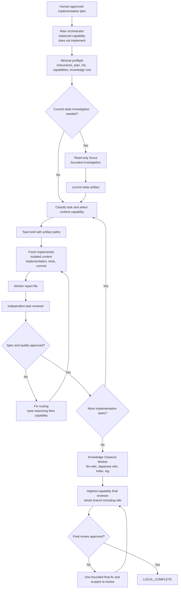

# SDD Implementation Skill 設計

## 状態

Humanがwritten designを承認し、`sdd-implementation-skill-implementation-plan.md`を実行候補として作成した。production skillの実装、既存loop skillの変更・削除、push、PR作成、merge、release、live installは未実施。

## 問題設定

現在の repository change workflow は、`grill-to-pr-loop` と `issue-implementation-loop` が planning、worker dispatch、review、runtime state、recovery、delivery を広く所有している。一方、現在の Superpowers Subagent-Driven Development（以下 SDD）は、fresh implementer、task brief、report、task review、fix loop、progress ledger、final branch review、worktree finish をすでに提供する。

新しい実装 skill が SDD と同じ execution engine を再実装すると、main context の汚染を防ぐための仕組み自体が保守対象となり、既存 loop skill と同じ複雑性を再生産する。

必要な repository 固有機能は次の 2 つに絞る。

1. task / role / risk に応じて、host runtime が利用可能な model と reasoning effort を実行時に routing する。
2. 実装完了時に `llm-wiki` を使い、日本語 wiki と `knowledge/index.md` / `knowledge/log.md` を同期する。

## 目的

承認済み implementation plan を入力として受け取り、main context を orchestration に限定したまま SDD を実行し、code、tests、review、wiki closeout を含む local completion まで進める新しい user-facing skill を作る。

skill name は `sdd-implementation` とする。

## 最優先原則

### 1. シンプルさと要件実現を最優先する

実装は、承認済み要件と acceptance criteria を満たす最も単純な形を優先する。将来の仮説、汎用化の可能性、既存workflowとの互換性だけを理由に、新しい abstraction、schema、state、adapter、fallback、設定項目を増やさない。

- SDD と `llm-wiki` が所有する機構を再実装しない。
- current requirement に不要な extension point を作らない。
- caller が学ぶ interface と durable artifact の種類を増やさない。
- 既存の明確なrepository patternを再利用し、同じ責務の第2実装を作らない。
- correctness、明確性、必要なverificationを削ることは「単純化」に含めない。

要件実現と単純性が衝突する場合は要件実現を優先し、その要件を満たす範囲で最小のimplementationを選ぶ。

### 2. Reviewはmaterial findingだけを扱う

task review と final review は、次の順で確認する。

1. 承認済み要件を過不足なく実現しているか。
2. 同じ要件をより小さいinterface、少ない機構、明確なownershipで実現できるmaterialな単純化余地があるか。
3. current changeにcorrectness、regression、security、data loss、operability、maintainabilityのmaterial riskがあるか。

fix loopを開始できるのは、requirement gap、scope excess、observable regression、またはcurrent changeのmaterial riskだけとする。reviewerはfindingごとに、違反するrequirementまたは具体的なcurrent riskとevidenceを示す。

material simplicity findingには、同じ要件とrisk boundaryを満たす具体的なsimpler alternative、現行実装が増やす機構、変更によるmaterial impactを必須とする。具体案を示せない好みや数行の短縮はfindingにしない。

次はblocking findingにしない。

- 動作と理解に影響しないstyle、命名、formattingの好み
- 具体的なfailure pathがない将来懸念
- approved scope外のrefactor、hardening、汎用化提案
- formatter / linterが扱う軽微な差
- 同等に明確な複数実装のうち、reviewerが別案を好むという理由だけの指摘

non-blocking observationは必要な場合だけ短く残し、fix loopやcompletionを妨げない。review件数を増やすことを品質とみなさず、重箱の隅をつつくことで要件、単純性、current riskから注意を逸らさない。

このreporting thresholdはmechanical validator、formatter、linter、schema check、digest check、required test suiteの実行範囲を狭めない。機械的に検出できる失敗は従来どおり検証し、その失敗がblocking conditionなら修正する。

## Interface

```text
sdd-implementation(<approved implementation plan path>)
    -> capability / repository preflight
    -> optional read-only current-state investigation
    -> runtime-only model / reasoning routing
    -> Superpowers SDD task loop
    -> llm-wiki knowledge closeout
    -> final whole-branch review
    -> LOCAL_COMPLETE | BLOCKED
```

必須入力は承認済み implementation plan の path とする。repository root、knowledge root、current worktree、default branch は repository instructions と Git state から解決する。caller に packet、envelope、scheduler state、worker schema の知識を要求しない。

## 採用した判断

### SDD を execution engine とする

- fresh implementer、task brief、worker report、task review、fix loop、progress ledger、final review は Superpowers SDD に委譲する。
- 新skillは独自 scheduler、event log、runtime snapshot、resume brief、worker packet schema、review state machineを作らない。
- SDD が利用不能、または isolated subagent dispatch が利用不能なら、安全性を弱める fallback を作らず `BLOCKED` とする。
- implementation subagent は親会話を継承せず、host が対応する場合は equivalent of `fork_turns="none"` を使う。必要情報は durable file path と短い scene-setting だけで渡す。

### main orchestrator は balanced capability を既定とする

main session が orchestrator となり、別の常設 orchestrator agent は作らない。orchestrator は production code、広範な current-state investigation、task review、wiki authoring を担当しない。

orchestrator が保持する情報は次に限定する。

- plan path
- task ID / status
- brief、report、review package の path
- active subagent identity
- base / head commit
- routing class
- blocker と短い verdict

diff、test log、調査全文、実装報告全文は main conversation に貼らない。

orchestrator の通常業務は state transition、path handoff、wait、routing、ledger update であるため、highest-capability model を常用しない。balanced capability を既定とし、深い判断だけを高能力 subagent へ委譲する。

### current-state investigation は optional read-only Scout に委譲する

implementation plan に対象 file、interface、acceptance criteria、verification が十分に含まれる場合、Scout は起動しない。

plan と current tree の対応が不明、既存 interface / tests / call sites の確認が必要、または drift の疑いがある場合だけ read-only Scout を起動する。Scout は bounded paths を調査し、詳細を SDD workspace の `current-state.md` 相当へ保存し、main へは status、artifact path、blocking concern だけを返す。

通常調査は balanced-to-high capability、広範な architecture、concurrency、security、unknown regression investigation は high capability とする。

### model / reasoning routing は runtime-only とする

repository に永続化するのは role と capability class の関係だけとし、具体的 model 名、reasoning effort 値、provider、price、availability、agent ID、run ごとの選択結果は永続化しない。

既定の capability class は次とする。

| Role | Work class | Runtime capability |
|---|---|---|
| orchestrator | state、routing、path handoff | balanced |
| Scout | bounded current-state investigation | balanced-to-high |
| implementer | mechanical、exact 1〜2 file change | economical balanced |
| implementer | multi-file integration | balanced-to-high |
| implementer | debugging、architecture-sensitive、high-risk | high |
| task reviewer | task diff のspec適合・品質 | risk相応、implementer以上 |
| adjudicator | plan conflict、review disagreement、scope ambiguity | high |
| knowledge closeout worker | llm-wikiによる日本語同期 | balanced-to-high |
| final reviewer | code、tests、wikiを含むwhole-branch review | highest available |

user が実行時に model / effort を明示した場合はその指定を優先する。指定がない場合は orchestrator が role、task complexity、risk から runtime capability を選ぶ。

fix が収束しない場合は、同じ instruction の単純再試行を避ける。host が対応する範囲で reasoning depth を上げ、それでも不足する場合に model capability tier を上げる。利用予定の capability が unavailable の場合は、同等以上の利用可能 capability を選ぶ。安全に代替できなければ停止する。

この routing は [Planning Authority Policy 仕様](planning-authority-policy/spec.md) の `model_selection = host_runtime` / `model_persistence = forbidden` と両立させる。routing decision は host tool call にだけ反映し、plan、wiki、ledger、packet、schemaへ run-specific 値を追加しない。

### wiki closeout を final review の前に置く

すべての implementation task と task review が完了した後、final whole-branch review の前に Knowledge Closeout Worker を起動する。

Knowledge Closeout Worker は repository root と knowledge root の `AGENTS.md` を読み、`llm-wiki` の current topology / write boundary に従う。

knowledge root が存在する場合、material implementation の完了条件は次のとおり。

- relevant spec、design、implementation plan、progress / issue ledger の状態を日本語で同期する。
- 新規または更新した active canonical page を `knowledge/index.md` から発見可能にする。
- `knowledge/log.md` に closeout entry を追加する。
- stable ID、path、command、schema key、code symbol、error text、external reference は互換性のため原文を維持する。
- repository の wiki validation を実行する。

knowledge root が存在しない repository では `not_applicable` として完了可能とする。knowledge root が存在するのに authority、write boundary、validation、canonical target が解決できない場合、wiki sync を省略せず `BLOCKED` とする。

wiki closeout 後に final reviewer を起動し、code、tests、durable docs、index、logを同じ branch range で確認する。これにより、codeだけreview済みでwiki変更が未reviewという状態を作らない。

### Review packet は目的を狭く保つ

task reviewerにはapproved task、binding global constraints、committed diff、verification reportだけを渡す。final reviewerにはwhole-branch diff、approved plan、task completion ledger、wiki closeout resultだけを渡す。

review promptは「追加の改善案を広く探す」のではなく、要件適合、material simplicity、material current riskの3点だけを求める。out-of-scope future hardeningは、current PRをblockする具体的リスクがない限りreview resultへ混ぜない。

## End-to-End Flow



## Error Handling And Stop Conditions

- approved implementation plan がない、または scope / acceptance criteria が実装可能な粒度でない場合、planning へ戻す。
- current tree と plan がmaterialに不一致なら Scout evidence を保存し、Humanへ scope decision を戻す。orchestrator がplanを暗黙に変更しない。
- SDD、isolated subagent、independent reviewer、required worktree、必要なdomain skillが利用不能なら停止する。
- implementerが`NEEDS_CONTEXT`なら不足pathだけを追加し、conversation historyを転送しない。
- implementerが`BLOCKED`なら context不足、capability不足、task過大、plan defectを切り分ける。
- reviewer findingとapproved planが衝突する場合、high-capability adjudicatorがevidenceを整理し、authority-bearing decisionはHumanへ戻す。
- requirementまたはmaterial current riskへ紐づかないreview findingはfix loopへ入れず、必要ならnon-blocking observationとして扱う。
- wiki write authority、canonical target、index/log sync、wiki validationのいずれかが解決しない場合、knowledge rootがあるrepositoryでは`LOCAL_COMPLETE`にしない。
- remote write、push、PR、merge、release、live installはこのskillから実行しない。

## Dual-Host Contract

新skillは Codex と Hermes Agent の両方から同じ `SKILL.md` を読めるようにする。

- host-specific tool nameを共通contractに固定しない。
- Codexではisolated subagent dispatch、per-dispatch runtime model / reasoning selection、wait / resume相当のcapabilityを検出する。
- HermesではSDDまたは同等のfresh worker / reviewer orchestrationとruntime routing capabilityを検出する。
- capabilityが不足するhostでは、main coordinator implementationや旧loop skillへのsilent fallbackを行わず、platform boundaryを報告して停止する。
- skill discovery routeとdual-host validatorを実装時のacceptanceに含める。

## Migration

### Phase 1: 新skillを既定入口にする

- `sdd-implementation` を新規追加する。
- approved implementation plan の既定実行入口を `sdd-implementation` にする。
- 既存 `grill-to-pr-loop` / `issue-implementation-loop` は移行期間中のみ残し、明示指定時だけ使用する。
- 新skillは旧loop skillのschema、scripts、references、runtime artifactsに依存しない。
- routing priorityはrepo-level router / architecture policyで表現し、旧skill内部へcompatibility layerを追加しない。

### Phase 2: 旧loop familyを別PRで削除する

- `skills/grill-to-pr-loop/` と `skills/issue-implementation-loop/` を削除する。
- 専用のruntime schema、templates、scripts、tests、context contracts、family validators / baselinesをcurrent treeから除去または新architectureへ更新する。
- historical wiki source / spec / ledgerは実行可能artifactとして再利用せず、superseded / historicalとして保持する。durable decision historyを無差別に削除しない。
- new skillの実run evidenceとforward verificationが揃う前にPhase 2へ進まない。

Phase 1 と Phase 2 を同一PRにしない。新skillのforward testとfallback behaviorを確認してから削除scopeを確定する。

## Testing Strategy

新skillのinterfaceとobservable outcomeをtest surfaceとし、SDD内部実装を複製してtestしない。

### Contract Tests

- approved plan path がない場合に停止する。
- knowledge root の有無を正しく判定する。
- knowledge root がある場合、wiki / index / log closeoutが必須になる。
- role / complexity / risk からabstract runtime capabilityを選ぶ。
- concrete model / reasoning / provider / agent IDをdurable artifactへ保存しない。
- parent conversation inheritanceを禁止するdispatch contractを持つ。
- old loop skillをdefault dependencyまたはfallbackとして参照しない。
- dual-host capability不足時にfail closedする。
- review contractが要件適合、material simplicity、material current riskの3観点に限定されている。
- material simplicity findingがconcrete simpler alternativeとmaterial impactを要求する。
- style preference、speculative future concern、out-of-scope hardeningがblocking findingにならない。
- mechanical validationとrequired test suiteの検出範囲を狭めない。

### Forward Scenarios

1. exactなsingle-file planをScoutなしで実行する。
2. current tree確認が必要なplanでread-only Scoutを起動し、mainにはartifact pathだけを返す。
3. mechanical、integration、high-risk taskが異なるruntime capabilityへ分類される。
4. user runtime overrideが既定routingより優先される。
5. task review failureがbounded fixへ戻り、mainがproduction codeを修正しない。
6. knowledge rootありのrepositoryで日本語wiki、index、logが同期されてからfinal reviewされる。
7. knowledge rootなしのrepositoryでcloseoutが`not_applicable`になる。
8. wiki validation failureが`LOCAL_COMPLETE`をblockする。
9. model availability変化がspec / plan driftを起こさない。
10. requirementとmaterial riskへ紐づかないreview observationがfix loopを開始しない。
11. requirementを満たすために不要なschema、state、adapterを追加した実装がmaterial simplicity findingになる。

## Completion Contract

`LOCAL_COMPLETE` は次をすべて満たす場合だけ返す。

- approved plan の全implementation taskがtask reviewを通過している。
- required verificationがfreshに成功している。
- scoped commitsがcurrent branchに含まれる。
- knowledge rootがある場合、wiki / index / log closeoutとvalidationが完了している。
- wiki closeout後のwhole-branch final reviewがapprovedである。
- blocking review findingがrequirement gap、scope excess、observable regression、material current riskのいずれかへevidence付きで分類されている。
- style preference、speculative future concern、out-of-scope hardeningだけを理由にcompletionが止められていない。
- blocker、residual risk、未実施remote actionが短く報告されている。

## 非目標

- planning、brainstorming、spec authoring、Human approvalを新skillへ取り込まない。
- Superpowers SDDをfork、vendor、再実装しない。
- provider固有model catalog、price、latency、benchmarkをrepositoryで管理しない。
- run-specific model / reasoning choiceをwiki、plan、ledger、schemaへ保存しない。
- custom scheduler、queue、event store、runtime snapshot、worker packet、resume cacheを作らない。
- old loop skillの削除をPhase 1へ含めない。
- push、PR作成、merge、release、live installを自動化しない。

## 関連ページ

- [Planning Authority Policy 仕様](planning-authority-policy/spec.md) — planning authorityとruntime model persistenceの既存契約。
- [Loop Skill 運用単純化仕様](loop-skill-operational-simplicity-spec.md) — 旧loop familyの複雑性と適用基準。
- [Loop Skill Architecture V3 Spec](loop-skill-architecture-v3-spec.md) — 旧runtime、worker packet、resume brief設計のhistorical比較対象。

## 出典

- [Planning Authority Policy 仕様](planning-authority-policy/spec.md)
- [Loop Skill 運用単純化仕様](loop-skill-operational-simplicity-spec.md)
- [skills/grill-to-pr-loop/SKILL.md](../../../skills/grill-to-pr-loop/SKILL.md)
- [skills/issue-implementation-loop/SKILL.md](../../../skills/issue-implementation-loop/SKILL.md)
- `codex-plugin-cache:openai-curated-remote/superpowers/6.2.0/skills/subagent-driven-development/SKILL.md`
