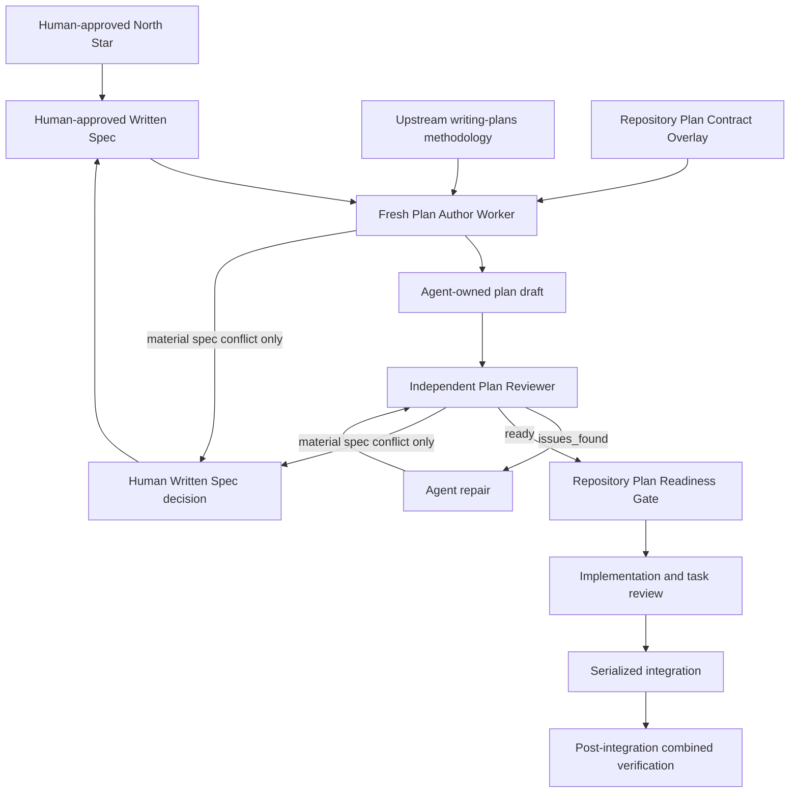

# SDD Plan Ownership Alignment 仕様

## 状態

Human は 2026-08-14 に North Star、以下の `Confirmed Decisions` 8件、この synthesis 全文を
Written Spec として明示承認した。本仕様は `accepted` / `approved` の active canonical Written Spec
であり、Plan Stage の authority gate を満たす。この承認は agent-owned plan readiness、implementation
完了、または push / PR creation / live install / deployment を含む remote / privileged / destructive
action の authorization を意味しない。

Human は 2026-08-14 に `sdd-transient-artifact-boundary-2026-08-14` amendment を明示承認した。
この amendment は、repository の `.superpowers/**` を durable artifact surface にせず、通常時の
worker handoff を runtime temporary / repository 外へ置き、例外的な local scratch と Git index の
境界を fail closed にする。frontmatter の `approval_snapshot_sha256` は amendment 前の original
Written Spec snapshot identityだけを表し、この amendment後のbytesをcoverするとは扱わない。amendmentの
authorityとscopeは`amended_on`、`approved_amendments`、`Confirmed Decisions` 9、および `R-16`〜`R-21`
で追跡する。North Starと既存のHuman / agent ownership boundaryは変更しない。

2026-08-14にTask POA-1のreviewed intentional RED contractとTask POA-2のreviewed combined GREENが
current branchへlandedした。Task POA-3は本仕様、broader current design、focused context specification、
canonical catalog、append-only logを同じlanded semanticsへ同期し、fresh combined verificationを行う。
このstateはcanonical final whole-branch review前のcloseout candidateであり、`LOCAL_COMPLETE`、remote action、
またはHuman plan approvalを宣言しない。

Human-approved transient-artifact amendmentのPOA-5 migration / validator、POA-6 exact cleanup、および
cleanup fixture correctionは2026-08-14にreview済みでlandedした。POA-7はそのactual Git / file / test evidenceを
本仕様、broader current design、reviewed plan、catalog、append-only logへ同期するdurable closeoutである。
POA-8のfresh combined verification、canonical whole-branch review、authorized remote branch updateはpendingであり、
本closeoutは`LOCAL_COMPLETE`またはpublicationを宣言しない。

[[sdd-plan-ownership-alignment-implementation-plan|agent-authored implementation plan]]のapproved spec
SHA-256 `1f9a7dc5f740c51addfabde96bac6fe3fbf5036003d1783cde60ac58e5ae7559`は、Plan Authorがconsumeした
承認時snapshotのbinding identityである。Task POA-3が追記するlanded stateとprovenance relationは
post-approval lifecycle metadataであり、承認済みNorth Star、requirements、acceptance criteria、non-goals、
stop conditionsを変更しない。

本仕様は [[sdd-implementation-skill-design|SDD Implementation Skill 設計]] と
[[sdd-preimplementation-context-isolation-spec|SDD 実装前コンテキスト分離仕様]]のうち、Plan Stage の
ownership、approval、artifact content、readiness、Human return 条件をsupersedeする。さらに
`sdd-transient-artifact-boundary-2026-08-14` amendmentは、Research、Spec、Plan、Implementation、
task review、repair、integration、final review、knowledge closeoutを含む**すべてのSDD stage**のtransient
artifact destination / write bindingを統一し、repository内の`.superpowers/**`へresearch report、review
report、brief、worker packet、transcriptその他のraw handoffを要求する既存repository contractを、競合する
範囲で明示的にsupersedeする。これはsource codeとdurable knowledgeのwriteをtrusted planning worktree内に
閉じ込める規則、original checkout safety、Superpowers-first lifecycle、Planning Controller / fresh worker分離、
implementation review、knowledge closeout、remote authorization boundaryを変更しない。

## 問題

現行の `sdd-implementation` は、Human が material decision と Written Spec を所有する
一方で、Plan Stage に `Approved plan`、`Repository-approved implementation plan`、
repository-required plan approval、場合によっては Human approval を要求している。
そのため、Human が「何を達成するか」を承認した後にも、agent が選ぶ file、command、
snippet、commit 粒度などの実装方法を Human が再び審査する構造になり得る。

また、upstream Superpowers `writing-plans` は有用な task decomposition、file
responsibility、TDD、task interface、self-review を提供するが、標準 plan artifact に
prospective production code、test code、shell command、commit command の本文を要求する。
この output shape をそのまま採用すると、Written Spec と implementation の間に、まだ
実行も検証もされていない code を durable plan として固定してしまう。

現在の repository contract は plan-level spec coverage を確認するが、各 task がどの
spec requirement と acceptance criterion を満たすか、task dependency と execution order、
serialized integration order、integration 後の combined verification を必須 schema として
固定していない。このため、plan が実行可能に見えても unassigned requirement や integration
gap が残り得る。

## North Star

Human は North Star と Written Spec を通じて「何を達成するか」「何を達成しないか」
「どの observable acceptance を満たすか」を承認する。承認済み scope の中では、agent が
task decomposition、implementation method、validation method、execution order、integration
order、repair を自律的に設計・検証・実行する。

Human に implementation method、prospective code、file choice、command choice、snippet、
commit granularity の妥当性判断を求めない。plan は Human approval artifact ではなく、
repository が implementation を安全に開始するための agent-owned execution contract とする。

## Goals

1. Human approval を North Star と Written Spec に限定する。
2. plan creation、plan review、plan repair、plan readiness を agent / repository ownership にする。
3. plan の全 task を exact spec requirement と acceptance criterion へ trace 可能にする。
4. task dependency、execution order、integration order、post-integration verification を plan の
   required content にする。
5. unassigned spec requirement がある plan を implementation-ready にしない。
6. plan artifact から prospective production code、test code、script body、patch body を除外する。
7. upstream `superpowers:writing-plans` の lifecycle と decomposition 方法論を維持し、
   repository-specific overlay で artifact contract だけを適応する。
8. plan deficiency を agent が修正し、Human へ implementation method の判断を返さない。
9. `sdd-implementation` の portable inputs、outputs、required capabilities を維持する。
10. Human-owned Written Spec から agent-owned plan、implementation、integration、combined
    verification までを一方向の control flow にする。

## Non-goals

- Superpowers `writing-plans` を fork、vendor、copy、置換すること。
- upstream の brainstorming、TDD、subagent-driven development、task review、final review を
  repo-local scheduler として再実装すること。
- Human approval を implementation plan、task breakdown、file map、test method、command、
  commit boundary へ拡張すること。
- plan に prospective production code、test code、script body、patch body、擬似 patch を保存すること。
- plan を source code の代替、test implementation の代替、worker packet、runtime ledger、
  event log、resume protocol にすること。
- Human-approved Written Spec の product boundary を plan author や plan reviewer が変更すること。
- remote write、credential、permission、billing、production、destructive action に必要な
  separate authorization を plan readiness から推論すること。
- historical plan の過去の approval / execution evidence を書き換えること。
- amendment前のhistorical commitから`.superpowers/**` blobを除くためにGit historyを書き換えること。
- concrete runtime、tool name、model、provider、agent ID を portable skill contract に固定すること。

## Confirmed Decisions

1. Human は North Star と Written Spec を通じて達成対象を承認し、agent は task
   decomposition、order、integration を自律的に設計・検証・実行する。Human に
   implementation method または prospective code の判断を求めない。
2. Human approval は North Star と Written Spec に限定する。
3. plan creation、review、readiness は agent / repository ownership とする。
4. plan は task decomposition、task ごとの exact spec / acceptance coverage、dependencies、
   execution order、integration order、post-integration verification を含み、unassigned spec
   requirement を残さない。
5. plan は prospective production code、test code、script body、patch body を含めない。
   file、command、snippet、commit granularity を Human の判断対象にしない。
6. plan deficiency は agent が修正する。Human に戻すのは material な North Star / Written
   Spec change、または repository evidence だけでは解消できない material decision がある場合だけとする。
7. upstream `superpowers:writing-plans` は copy / replacement ではなく repository-specific
   overlay で適応する。
8. Human plan approval、prospective-code prohibition、complete coverage、ordering / integration
   contract を regression tests で固定する。
9. repository の `.superpowers/**` は transient scratch 専用であり、すべての通常の SDD stage は
   spec、plan、task content、worker / fix report、raw review output、transcript のduplicateをそこへ
   作らない。handoffはruntime temporary / repository外を使う。concreteなoperational reasonで
   repository-local scratchが必要な場合だけ、対象pathをwrite前に`.gitignore`でcoverし、Git index / staged
   tree / committed treeへentryを作らず、ignored / untracked / unstaged / uncommitted stateに留める。durable
   summaryはcanonical spec、reviewed plan、knowledge logだけへ統合する。current PRのtracked report 3件は
   final treeから除き、必要なlocal scratchは削除せずignored / untracked stateで保持できるようにする。
   cleanup後のcandidate / final PR tree、Git index / staging area、以後のすべてのnew commit treeは
   `.superpowers/**` entry zeroとする。amendment前のhistorical ancestor commitはrewriteせず、そのblobを
   audit historyとして保持できるが、new commitが再導入してはならない。このinvariantはmechanical
   validationとtestsで固定する。

## Open Decisions

なし。

## 用語

### North Star

Human が承認する、達成対象、価値、scope、成功状態の短い authority-bearing statement。
implementation method は含めない。

### Written Spec

Human が承認する、problem、goals、non-goals、behavioral / architectural boundary、observable
acceptance、material risk、stop condition を持つ canonical artifact。implementation method の
選択を plan authorへ委譲できる粒度で完全でなければならない。

### Plan Contract Overlay

upstream `writing-plans` の lifecycle と reasoning primitives を利用しながら、この repository の
plan artifact に必要な schema、禁止内容、review、readiness semantics を追加または上書きする
repo-local contract。upstream source の copy ではなく、composition seam である。

### Plan Author Worker

approved Written Spec、current repository evidence、upstream `writing-plans`、Plan Contract
Overlay を読み、agent-owned plan を作成・自己検査する fresh worker。Human authority を持たない。

### Plan Reviewer

Plan Author とは独立した fresh agent reviewer。spec coverage、task boundary、dependency、
execution / integration order、post-integration verification、禁止内容、current-tree
buildability を確認し、内部 review verdict として `ready` または `issues_found` を返す。
`issues_found` は plan deficiency、material spec conflict、または non-decision blocker に分類する。
Human approval を代替する authority ではなく、repository readiness を判定する agent-owned role である。

### Plan Readiness Gate

approved Written Spec への binding、required plan schema、independent review、repository
policy checks を満たしたことを確認する agent / repository-owned gate。Human approval gate
ではない。disposition は `ready`、`needs_repair`、`needs_decision`、`blocked` のいずれかとし、
次の mapping 以外を許さない。

| Readiness disposition | 既存 Control Return | Implementation Stage entry | Routing |
|---|---|---|---|
| `ready` | `status: complete`、`artifact_path`: approved spec-bound plan、`decision_requests: none`、`material_risks: none` | 可。Planning Controller が current spec binding と readiness evidence を確認した場合だけ entry する | plan artifact を渡す |
| `needs_repair` | 返さない | 不可 | exact deficiency と artifact path を agent repair へ渡し、independent re-review を継続する内部状態 |
| `needs_decision` | `status: needs_decision`、`artifact_path`: finding を保持する plan / review artifact、`decision_requests`: material decision 1件、`material_risks`: conflicting evidence と impact | 不可 | material spec conflict を Spec Stage / Human authority へ返す |
| `blocked` | `status: blocked`、`artifact_path`: diagnostic artifact または `none`、`decision_requests: none`、`material_risks`: exact blocker | 不可 | capability、trusted binding、authority、write boundary など decision では解消しない blocker を返す |

`ready` だけが Plan Stage の成功終了であり、Control Return の `complete` へ変換される。
`issues_found` 自体を Control Return `status` にせず、finding の分類によって `needs_repair`、
`needs_decision`、`blocked` のいずれかへ決定的に route する。remote / privileged / destructive
action の未承認は plan の内容・binding・repository checks の不足ではないため、この gate の
`blocked` へは mapping しない。

### Plan Deficiency

missing coverage、曖昧な task boundary、dependency cycle、execution / integration order の
欠落、verification gap、禁止された prospective body、current tree との不一致など、
Written Spec を変更せず plan author / reviewer が修正できる問題。

### Material Spec Conflict

repository evidence と approved North Star / Written Spec が両立せず、達成対象、scope、
observable acceptance、material risk acceptance の変更が必要になる状態。これは plan
deficiency ではなく Human authority へ戻す。

## Requirements

### Human authority

- **R-01:** Human approval checkpoint は North Star approval と Written Spec approval だけにする。
- **R-02:** plan、task decomposition、file / command / commit strategy、review verdict、readiness に
  Human approval を要求しない。
- **R-03:** Human への return は material North Star / Written Spec change または unresolved
  material decision に限定する。
- **R-04:** push、PR creation、live install / deployment を含む remote / privileged / destructive
  action の separate authorization は plan approval と混同せず、既存 safety boundary のまま維持する。

### Plan ownership and content

- **R-05:** Plan Author Worker と Plan Reviewer が plan creation、review、repair、readiness を所有する。
- **R-06:** plan は task ごとに deliverable、covered requirement IDs、covered acceptance IDs、
  dependencies、consumed / produced behavioral contract、verification intent を記録する。
- **R-07:** plan は全 requirement / acceptance を task へ割り当てた coverage matrix を持つ。
  coverage がゼロの item を許さない。複数 task に跨る item は primary owner と contributing task を区別する。
- **R-08:** plan は dependency graph と、dependency を破らない execution order を持つ。
- **R-09:** plan は execution order と区別された serialized integration order、integration precondition、
  combined-state expectation を持つ。
- **R-10:** plan は integration 後に実行する combined verification の scope、pass criteria、
  required evidence、failure owner を持つ。
- **R-11:** plan は prospective production code、test code、script body、patch body、擬似 patch を
  含めない。test は intent、observable behavior、fixture class、failure / pass condition で表現する。
- **R-12:** exact file path、line number、command、snippet、commit boundary は plan readiness の
  Human judgement subject にしない。agent が必要に応じて execution metadata として解決できるが、
  required Human checkpoint や product requirement にはしない。

### Upstream adaptation and portability

- **R-13:** `superpowers:writing-plans` は required dependency のまま維持し、task sizing、file
  responsibility、TDD sequence、interface reasoning、self-review の source methodology として使う。
- **R-14:** upstream が要求する prospective body、Human execution-choice prompt、plan approval
  semantics と local contract が衝突する場合、Plan Contract Overlay が output artifact と routing
  behaviorについて優先する。upstream source 自体は変更しない。
- **R-15:** portable skill contract は runtime identity ではなく inputs、outputs、required
  capabilities で定義し、missing capability は fail closed にする。

### Transient artifact and Git boundary

- **R-16:** Research、Spec、Plan、Implementation、task review、repair、integration、final review、knowledge
  closeoutを含むすべてのnormal SDD stageは、spec、plan、task content、research / worker / fix / review report、
  brief、raw review output、transcriptのduplicateをrepositoryの`.superpowers/**`へ作らない。stage間のtransient
  handoff / scratchはruntime temporaryまたはrepository外のtransient locationへ置き、durable artifact identity
  として`.superpowers/**`を参照しない。repository内のresearch / report / brief runtime pathを要求する既存の
  skill、reference、prompt、template、test contractは、このdestination / write-bindingについて本requirementが
  supersedeする。
- **R-17:** concreteなoperational reasonによりrepository-local `.superpowers/**` scratchが必要な場合だけ
  writeを許す。その場合、最初のwriteより前に`.gitignore`がrelevant pathをcoverすることをmechanically
  確認し、scratchはignored / untracked / unstaged / uncommittedのlocal stateに限定する。理由またはpre-write
  ignore coverageを証明できなければrepository-local writeを行わず、runtime temporary routeへ戻す。
- **R-18:** tracked-report cleanup後は、`.superpowers/**`のfile / directory entryがcurrent Git index
  （staging area）、そのindexから作るcandidate commit tree、以後に作るすべてのnew commit tree、およびPR final
  treeのいずれにも存在してはならない。ここで`tracked`はindex entryが存在する状態、`staged-tree entry`は
  indexが表すcandidate treeにcontentが存在する状態を指す。final treeからentryを除くstaged deletionは、削除後の
  index / candidate treeにcontent entryがないため許可する。amendment前のhistorical ancestor commitはaudit
  historyとして`.superpowers/**` blobを保持でき、別途の明示的なdestructive authorizationなしにrewriteしない。
  ただしcleanup後のnew commitはhistorical blobを新しいtreeへ再導入してはならない。
- **R-19:** durable review / worker / fix evidenceはraw reportやtranscriptを保存せず、必要なdecision、finding、
  repair、verdict、evidence identityだけをcanonical spec、reviewed plan、append-only `knowledge/log.md`へ
  synthesisする。同じspec / plan / task contentを複数surfaceに保存しない。
- **R-20:** repository validationとtestsは、cleanup後のGit index / staging area、candidate commit tree、new
  commit tree、PR final treeに`.superpowers/**` entryを検出したら失敗し、ignored / untracked / unstaged /
  uncommitted local scratchとfinal-tree removalのstaged deletionは許可する。checkはworking-tree pathの存在や
  pre-amendment historical ancestor commitのblobだけで失敗してはならず、new commitによる再導入は拒否する。
- **R-21:** current PRは次のtracked reportsをPR final treeから除く。operationally必要なlocal copyは、既存または
  write前に成立したignore coverageの下でworking treeに残してよく、追跡解除のために内容を破壊してはならない。
  - `.superpowers/sdd/sdd-plan-ownership-alignment-implementation-plan/approved-residual-fix-report.md`
  - `.superpowers/sdd/sdd-plan-ownership-alignment-implementation-plan/final-fix-report.md`
  - `.superpowers/sdd/sdd-plan-ownership-alignment-implementation-plan/task-2-report.md`

## Architecture And Boundaries

### Authority boundary

Human は North Star と Written Spec の content authority を持つ。Plan Author と Plan Reviewer は
その scope を変更せず、実装可能な task graph へ変換する operational authority を持つ。
Plan Readiness Gate は spec approval を再実行せず、plan が approved spec を完全かつ矛盾なく
実行可能にしているかだけを判定する。

Planning Controller は Human dialogue、approval state、Control Return、stage routing を保持するが、
plan の file mapping、method review、repair を行わない。plan deficiency は worker loop へ戻し、
Human question に変換しない。

### Upstream boundary

Superpowers は development methodology の canonical source のまま維持する。repo-local overlay は
次だけを所有する。

- local plan schema と required semantic fields。
- prospective-body prohibition。
- requirement / acceptance coverage invariant。
- execution order / integration order / combined verification invariant。
- independent agent review と readiness vocabulary。
- Human return condition と no-plan-approval routing。

overlay は upstream instructions を複製しない。task sizing、TDD、interface reasoning、self-review の
詳細は current discovered upstream skill を参照する。upstream default の保存先、code block、commit
command、Human execution-choice handoff は local output contract へ持ち込まない。

### Plan artifact boundary

plan は implementation intent と dependencyを保持するが、implementation bytesを保持しない。
各 task は少なくとも次の semantic fields を持つ。

| Field | Required meaning |
|---|---|
| Task identity | stable task ID と一意な責務 |
| Deliverable | task 完了後に観測できる独立成果 |
| Coverage | requirement IDs、acceptance IDs、primary / contributing ownership |
| Dependencies | 先行 task と、その output が必要な理由 |
| Behavioral interface | consumes / produces する observable contract。prospective signature body は含めない |
| Verification intent | RED/GREEN または同等の failure / success observation、scope、evidence class |
| Integration placement | integration 前提、integration 順序、後続 consumer |
| Failure owner | task deficiency を修正する agent role |

plan-level fields は North Star / Written Spec identity、baseline binding、global constraints、coverage
matrix、dependency graph、execution order、integration order、post-integration combined verification、
readiness result を持つ。

file responsibility map は agent の decomposition 補助として持てるが、path list は Human approval
subject ではない。exact commands、line ranges、snippets、commit commands は durable plan の必須
content ではなく、executor が current tree に対して実行時に解決する。

### Transient handoff boundary

Canonical spec、reviewed plan、knowledge logはdurable summaryを所有する。runtime temporary / repository外の
handoff locationはraw worker outputのtransient transportを所有し、retentionまたはclone-stable provenanceを
保証しない。`.superpowers/**`はconcreteなruntime needがある場合のignored local scratchだけを所有し、
durable plan、task packet、review record、fix reportの第二の正本にはならない。

repository外のtransient locationは、runtimeが当該task / session用に解決したbounded pathであり、repository
root、planning worktree、original checkoutの外にあることをwrite前に確認する。そこへrepository sourceまたは
canonical knowledgeを書かず、raw handoffのtemporary transportとしてだけbindする。後続stageはそのpathの永続性を
前提にせず、必要なsummaryをcanonical destinationへ同期する。accessとcleanupはruntime / OS temporary storageの
境界に従い、未解決path、repository tree内へaliasするpath、またはtask scope外のbroad pathにはwriteしない。

SDD stageはtransient outputから後続stageに必要なdecision、finding、evidence identity、verdictだけを抽出する。
再現に必要なcontractはcanonical specまたはreviewed planへ、durable lifecycle effectは`knowledge/log.md`へ
統合した後、raw report / transcriptをGit provenanceとして要求しない。validatorはworking treeではなくGit
index / staged treeとcommit treeのentryを検査するため、ignored local scratchを壊さずrepository invariantを
強制できる。

### Review boundary

Plan Reviewer は implementation code の正しさを予測しない。次を evidence-backed に確認する。

1. approved Written Spec identity と plan binding が current である。
2. 全 requirement / acceptance に primary task がある。
3. task boundary が独立 review 可能で、dependency と interface が矛盾しない。
4. execution order が dependency graph の topological order になっている。
5. integration order が explicit で、partial integration を completion と扱わない。
6. combined verification が integrated state と全 acceptance を覆う。
7. prospective body と Human plan approval が plan に含まれない。
8. plan が spec を拡張、縮小、または silently reinterpret していない。

Minor wording、style、将来だけの hardening は readiness を block しない。blocking finding は missing
spec coverage、contradiction、unbuildable dependency、missing integration / verification、prohibited
content、current-tree material conflict のいずれかに結び付ける。

## Portable Skill Contract

### Inputs

- Human-approved North Star identity。
- Human-approved current Written Spec path と approval state。
- resolved planning worktree root、bound CWD、contained writable plan artifact path。
- original checkout metadata の read-only tuple、baseline commit、current repository rules。
- active runtime で discovery した current `superpowers:writing-plans` skill path。
- repository Plan Contract Overlay と current plan state。
- knowledge root が存在する場合、その local authority、write boundary、authoring profile。

### Outputs

- internal `ready`: approved spec に binding された agent-reviewed plan、coverage result、ordering /
  integration result、post-integration verification contract、repository readiness evidence。既存 Control
  Return では `status: complete`、plan path、`decision_requests: none` として返す。
- internal `needs_repair`: exact plan deficiencies と修正対象 semantic fields。Control Return をまだ
  返さず、agent repair と independent re-review を続ける。Human decision request は生成しない。
- `needs_decision`: repository evidence と approved spec の material conflict。既存 Control Return では
  `status: needs_decision` とし、decision request は一件だけ返す。
- `blocked`: required capability、trusted binding、authority、write boundary、current-tree applicability
  など Human decision では解消しない不足。既存 Control Return では `status: blocked`、
  `decision_requests: none` とする。
- Planning Controller へは既存 Control Return の `status`、`artifact_path`、`decision_requests`、
  `material_risks` だけを返し、plan 本文、internal `needs_repair`、raw review output を持ち込まない。
- knowledge root がある場合、ready plan の canonical identity と required index/log sync result。

### Required capabilities

- current repository、approved spec、repository rules、bound artifact path を読めること。
- current upstream `writing-plans` と local overlay を active discovery で一意に解決し読めること。
- Plan Author と独立 Plan Reviewer を isolated fresh context で dispatch できること。
- repository evidenceからtask、coverage、dependencies、execution / integration order、verification
  contractを作成・検査できること。
- planning worktree 内だけへ durable edit を適用できること。
- knowledge root がある場合、selected authoring skill と `llm-wiki` の authority / index / log contractを
  満たせること。
- concrete host tool、runtime name、model、provider に依存せず、required capability 不足を
  `blocked` として返せること。

## Control Flow

1. Planning Controller が North Star と Written Spec の Human approval、spec authority、current
   applicability、worktree binding を確認する。
2. approved Written Spec がなければ Plan Stage に入らず、Spec Stage へ戻す。
3. fresh Plan Author Worker に bounded paths、approved spec、repository rules、current upstream
   `writing-plans`、local overlay を渡す。
4. Plan Author は current repository を調べ、spec requirement / acceptance inventory を stable ID で
  列挙し、task decompositionを作る。
5. 各 task に exact coverage、dependencies、behavioral interface、verification intent、integration
   placement を割り当てる。
6. plan-level coverage matrix、dependency graph、execution order、integration order、combined
   verification を作成する。
7. Plan Author が upstream の self-review primitive と local overlay checks を実行し、deficiency を
   inline repair する。
8. すべてのSDD stage間のraw research / worker / review / repair handoffはruntime temporary / repository外へ
   routeする。write前にtask / session用のbounded pathでありrepository root、planning worktree、original
   checkoutの外であることを確認し、durableに必要な
   summaryだけをcanonical spec、reviewed plan、knowledge logへ統合する。repository-local
   `.superpowers/**` scratchが不可避なら、concrete reasonとpre-write ignore coverageを確認する。
9. independent fresh Plan Reviewer が complete plan と approved spec を確認する。
10. `issues_found` は Plan Author / repair worker へ戻す。Written Spec の変更が不要なら Human へ
   route しない。
11. reviewer が `ready` を返し、repository checks と durable knowledge sync が成功したら Plan
    Readiness Gate を `ready` とし、Planning Controller へ `status: complete` を返す。Human approval は
    要求しない。Planning Controller がこの Control Return、current spec binding、plan artifact path を
    確認した場合だけ Implementation Stage に entry する。
12. implementation は ready plan の dependency / execution order に従い、各 task の implementation
    と task review を完了する。
13. integration は plan の serialized integration order に従い、全 required result が reachable で
    review済みであることを確認する。
14. integration 後に combined verification を実行し、approved Written Spec の全 acceptance を
    integrated state で確認する。
15. tracked-report cleanup後、commit / PR final-tree gateの前に`.superpowers/**`のGit index / staging area、
    candidate commit tree、以後のnew commit tree、PR final-tree entryがzeroであることをmechanically確認する。
    tracked reportsのmigrationはcontentをindexから除き、必要なignored local scratchをworking treeに保持する。
    pre-amendment historical ancestor commitはrewriteせず、new commitへの再導入だけをrejectする。
16. material spec conflict が判明した場合だけ `needs_decision` で停止し、prior approved statement、
    conflicting evidence、impact、必要な一件の Human decision を返す。capability、binding、authority
    failure は decision request なしの `blocked` とする。
17. local implementation / integration / combined verification の完了後に push、PR creation、live
    install / deployment を含む remote / privileged / destructive action が必要になった場合だけ、
    その action 固有の authorization gate を評価する。
    未承認なら当該 action だけを実行せず、plan readiness や local completion を遡って無効にしない。

## Failure Handling

- North Star または Written Spec が未承認、不完全、stale なら plan を作らず Spec Stage へ戻す。
- upstream `writing-plans` または local overlay を一意に discovery できなければ write 前に
  `blocked` とする。upstream を copy した fallback は作らない。
- Plan Author / independent reviewer の isolated dispatch が利用できなければ `blocked` とし、
  Planning Controller または Human に plan authoring / review を移さない。
- requirement / acceptance inventory に未割当があれば `needs_repair` とし、task の追加、merge、split、
  coverage 修正を agent が行う。
- dependency cycle、undefined produced contract、execution order violation、integration gap があれば
  `needs_repair` とし、agent が task graph を修正する。
- prospective body または Human plan approval language があれば `needs_repair` とし、plan から除く。
- exact path / command が実行時の current tree と一致しない場合は agent が再調査し、plan または
  execution metadataを更新する。Humanにmethod choiceを求めない。
- repository evidence が approved spec と material に衝突する場合は plan repair で隠さず、
  `needs_decision` として Human の Written Spec decision へ戻す。
- index/log sync または authoring check が失敗した場合は ready / complete を宣言せず、exact changed
  set と failed check を保持して agent が修復する。
- concrete operational reasonまたはpre-write `.gitignore` coverageを確認できないrepository-local
  `.superpowers/**` writeは行わず、runtime temporary / repository外のhandoffへrouteする。
- repository外のtransient pathがtask / session用にboundedされていない、またはrepository root、planning
  worktree、original checkoutの外であることを確認できない場合はwriteせず、安全なruntime temporary bindingを
  再解決する。
- cleanup後に`.superpowers/**` entryがtrackedまたはGit index / staging area / candidate treeに存在する場合は、commit、PR
  finalization、`LOCAL_COMPLETE`を停止する。ignore coverageを先に確認し、必要なworking-tree copyを
  保存したままindex entryを除去してvalidationを再実行する。
- raw report / transcriptだけがdurable decisionまたはrequired evidenceを保持している場合は、追跡解除前に
  必要なsummaryをcanonical spec、reviewed plan、knowledge logへsynthesisする。raw text自体をdurable
  artifactへcopyしない。
- validatorがignored / untracked scratchまたはfinal-tree removalのstaged deletionを誤って拒否する場合は、
  scratchを削除して回避せずvalidator semanticsを修正し、tracked / staged-tree entry検出と再検証を行う。
- combined verification failure は implementation / integration defect として agent fix pathへ戻す。
  spec changeが必要というevidenceがない限りHuman decisionへ変換しない。

## Testing Strategy

### Contract regression tests

1. **Human plan approval prohibition:** plan route、durable checkpoint、Planning Controller、Plan
   Readiness Gate が Human plan approval を要求せず、Human approval subject が North Star / Written
   Spec に限定されることを検査する。
2. **Prospective-code prohibition:** plan contract と representative plan fixture が production code、
   test code、script body、patch body、commit command body を要求または保持しないことを検査する。
3. **Complete coverage:** 全 requirement / acceptance ID に primary task があり、unknown ID、zero-owner、
   orphan task、unassigned requirement を拒否することを検査する。
4. **Ordering / integration:** dependency graph が acyclic で execution order と整合し、integration
   order、integration precondition、post-integration combined verification が必須であることを検査する。
5. **Repair routing:** plan deficiency が agent repairへrouteされ、material spec conflictだけがHuman
   decision requestを生成することを検査する。
6. **Overlay precedence:** upstream dependencyを維持しながら、upstreamのprospective bodyとHuman
   execution-choice handoffがlocal plan artifact / routingに入らないことを検査する。
7. **Portable contract:** Inputs、Outputs、Required Capabilities がnon-emptyで、concrete runtime名、
   model、provider、tool名をrequired behaviorにしないことを検査する。
8. **Readiness mapping:** reviewer `ready` / `issues_found`、readiness disposition、Control Return、
   Implementation Stage entry の mapping が一意であり、`needs_repair` が外部 return にならず、material
   spec conflict だけが `needs_decision` を生成することを検査する。
9. **Action authorization isolation:** push、PR creation、live install / deployment を含む remote /
   privileged / destructive authorization 不足が当該 action だけを止め、plan `ready`、Control Return
   `complete`、local implementation / completion をblockしないことを検査する。
10. **Transient artifact containment:** 全SDD stageのfixtureがrepository `.superpowers/**`へduplicate
    spec / plan / task content、research / worker / fix / review report、brief、raw transcriptを生成せず、transient
    handoffをtask / session用のboundedなruntime temporary / repository外pathへrouteすることを検査する。
11. **Git index invariant:** cleanup後の`.superpowers/**`のindex / staging-area entry、candidate / new commit
    tree entryをmechanical validationがrejectし、ignored / untracked / unstaged / uncommitted local scratchと、
    post-index treeからentryを除くstaged deletionをacceptすることをtemporary Git fixtureで検査する。
    pre-amendment ancestor blobはhistory rewriteを要求せず、cleanup後のnew commitへの再導入はrejectする。
12. **Durable-summary routing:** durable evidenceがcanonical spec、reviewed plan、knowledge logだけに
    synthesisされ、raw report / transcriptまたはduplicate task packetがdurable output setに含まれないことを
    contract testで検査する。

### Forward scenarios

1. approved spec の全 requirement を複数taskへ分解し、coverage matrix、dependency、execution / integration
   order、combined verificationを持つready planをHuman plan reviewなしで作る。
2. acceptanceが一件未割当のplanをreviewerが`issues_found`とし、agent修正後にreadyにする。
3. prospective test bodyを含むplanをrejectし、test intentとobservable pass conditionへ置換する。
4. dependency cycleをagentが修正し、Human decisionなしでtopological execution orderを再生成する。
5. file候補またはverification methodがcurrent treeとずれた場合、agentがrepository evidenceから修正する。
6. repository evidenceがapproved acceptanceと両立しない場合だけ、material spec conflictとしてHumanへ戻す。
7. ready planのtask実装後、serialized integrationとcombined verificationで全acceptanceを確認する。
8. remote publicationがplan-readyでも、separate authorizationなしではremote writeを行わない。
9. `.gitignore`でcoveredされたrepository-local scratchがworking treeに存在してもvalidationはpassし、同じ
   pathをindexへ追加するとfailする。tracked reportをindexから除くmigrationではlocal copyを必要に応じて
   保持し、PR final treeは`.superpowers/**` entry zeroになる。

## Acceptance Criteria

- **AC-01:** Human approval checkpointがNorth StarとWritten Specだけであり、plan approval promptがない。
- **AC-02:** Humanにfile、command、snippet、prospective code、commit granularityの判断を求めない。
- **AC-03:** Plan Authorと独立Plan Reviewerがplan creation、repair、review、readinessを完了でき、
  `ready`だけがControl Return `complete`へmapされてImplementation Stage entryを許可する。
- **AC-04:** planの各taskがrequirement IDとacceptance IDへtraceされ、全itemにprimary ownerがある。
- **AC-05:** planにunassigned requirement、orphan task、undefined dependencyがない。
- **AC-06:** dependency graph、execution order、serialized integration orderが明示され相互に整合する。
- **AC-07:** post-integration combined verificationが全acceptanceとintegrated stateを覆う。
- **AC-08:** planにprospective production / test code、script body、patch body、commit command bodyがない。
- **AC-09:** plan deficiencyはagent repairへrouteされ、Humanへ戻らない。
- **AC-10:** material North Star / Written Spec changeまたはunresolved material decisionだけが
  `needs_decision`を生成し、capability / binding / authority blockerはdecision requestなしの`blocked`になる。
- **AC-11:** upstream `writing-plans` はrequired dependencyのまま、local overlayがartifact / routing conflictを解消する。
- **AC-12:** portable Inputs、Outputs、Required Capabilities、worktree binding、knowledge sync、fail-closed behaviorを維持する。
- **AC-13:** push、PR creation、live install / deploymentを含むseparate remote / privileged /
  destructive authorization boundaryは変更されず、plan readinessから推論されない。authorization不足は
  対象actionだけを止め、plan readiness、local implementation、local completionをblockしない。
- **AC-14:** focused regression、skill architecture validation、applicable authoring / knowledge validationがfreshに成功する。
- **AC-15:** すべてのnormal SDD stageがduplicate spec / plan / task content、research / worker / fix / review
  report、brief、raw review output、transcriptをrepository `.superpowers/**`へ作らず、transient handoffを
  task / session用のboundedなruntime temporary / repository外pathへ置く。競合する既存repository-contained
  destination / write-binding contractは本requirementにsupersedeされる。
- **AC-16:** repository-local `.superpowers/**` scratchはconcrete operational reasonがある場合だけ、
  relevant `.gitignore` coverageの確認後にwriteされ、ignored / untracked / unstaged / uncommitted local stateに留まる。
- **AC-17:** cleanup後のGit index / staging area、candidate / final PR tree、以後のすべてのnew commit treeで
  `.superpowers/**` entryがzeroであり、mechanical validation / testsが再導入をrejectする一方、ignored local
  scratchとstaged deletionをacceptする。pre-amendment historical ancestor commitはrewrite対象にしない。
- **AC-18:** durable summaryはcanonical spec、reviewed plan、append-only knowledge logだけに存在し、raw
  worker / review / fix report、transcript、duplicate task contentがtracked durable artifactに存在しない。
- **AC-19:** `R-21`のtracked report 3件がPR final treeから除かれ、operationally必要なlocal copyは
  destructive deletionなしにignored / untracked stateで保持できる。
- **AC-20:** transient-artifact validatorのfocused regression、repository checks、Git index / final-tree
  inspection、applicable knowledge validationがfreshに成功する。

## Migration

1. current canonical SDD design の Human-approved Written Spec boundary は維持し、plan approval、
   `Approved plan`、`Repository-approved implementation plan` のcurrent semanticsだけを本仕様へ移す。
2. input maturity のplan stateはHuman-approvedではなく、current spec-boundかつrepository-readyな
   planとして表現する。
3. Durable Knowledgeのplan checkpointは`Repository-approved`ではなく、agent-reviewed / repository-ready
   planと、そのspec binding、coverage、readiness evidenceを保存するcheckpointへ更新する。
4. Planning ContextのPlan Authoringはupstream self-reviewにlocal overlayと独立Plan Reviewerを加え、
   Planning Controllerの評価対象をControl Return、path、spec binding、readiness resultに限定する。
5. current upstream skillは変更せず、repo-local SDD resourcesでoverlayのauthoring / review contractを
   提供する。具体的resource splitはagent-owned implementation planで決める。
6. existing contract testsのHuman plan approval literalsをremove / replaceし、本仕様の4つのrequired
   regression familyを追加する。
7. historical approved plan、approval log、implementation evidenceはhistorical identityのまま保持し、
   current execution entrypointとして再解釈しない。pre-amendment historical commitの`.superpowers/**` blobも
   audit historyとして保持し、別途の明示的なdestructive authorizationなしにhistory rewriteしない。
8. [[sdd-implementation-skill-design]] と [[sdd-preimplementation-context-isolation-spec]] はbroader
   lifecycleのcanonical sourceとして残す。Plan Stageのownership / approval / readiness conflictに加え、全SDD
   stageのtransient artifact destination / write-binding conflictでは本amendmentが優先する。planning worktreeの
   source / durable write containmentとoriginal checkout safetyは維持する。
9. implementation closeoutで本仕様、current SDD designのsupersession relation、index、append-only log、
   tests、validation evidenceを同期する。
10. 全SDD stageのresearch / worker / review / repair handoffをtask / session用のboundedなruntime temporary /
    repository外pathへ移し、`.superpowers/**`をreport / brief / worker packetのruntime destination、durable output
    destination、required provenance pathとして扱うskill、reference、prompt、template、test expectationを除く。
11. current `.gitignore`の`.superpowers/` coverageをtracked-report migration前に確認する。`R-21`の3 entryを
    Git indexとPR final treeから除き、まだconcrete operational needがあるlocal copyは同じignored pathへ
    保持する。required summaryがraw reportだけに残る場合は先にcanonical destinationへsynthesisする。
12. cleanup後の`.superpowers/**` index / staging-area / candidate-tree / new-commit-tree entryをfailさせ、ignored /
    untracked / unstaged / uncommitted scratchとstaged deletionを許すrepository validatorとfocused regressionを
    導入する。fresh validationでcandidate / PR final-tree entry zeroを確認するまでmigrationを完了扱いにせず、
    pre-amendment historical ancestor commitをrewriteしない。

## Stop Conditions

- Human-approved North StarまたはWritten Specが存在しない。
- Written Specにunresolved material decision、矛盾、acceptance gapが残る。
- trusted planning worktree / baseline / writable path bindingを証明できない。
- upstream `writing-plans` またはlocal overlayがmissing、ambiguous、unreadableである。
- isolated fresh Plan Authorまたはindependent Plan Reviewer capabilityがない。
- 全requirement / acceptanceへprimary taskを割り当てられない。
- dependency cycle、integration conflict、combined verification gapをagent repairで解消できない。
- current repository evidenceがapproved North Star / Written Specとmaterialに矛盾する。
- plan、index、log、authoring、repository validationのfailureが残る。
- repository-local `.superpowers/**` writeにconcrete operational reasonまたはpre-write ignore coverageがない。
- repository外のtransient write先がtask / session用のbounded pathではない、またはrepository root、planning
  worktree、original checkoutの外であると確認できない。
- cleanup後の`.superpowers/**` entryがGit index / staging area、candidate commit tree、new commit tree、PR final
  treeのいずれかに残る、またはnew commitへ再導入される。
- tracked reportをindexから除く前に、そこだけにあるrequired durable summaryのcanonical destinationを
  特定できない。
- required local scratchを保持する必要があるのに、追跡解除がdestructive content deletionを要求する。
- transient-artifact validationがignored / untracked scratchとtracked / staged-tree entryを区別できない。

停止時、plan deficiencyはexact findingとartifact pathをagent repair routeへ返す。Humanへ返す場合は、
material conflictのあるNorth Star / Written Spec statement、repository evidence、impact、必要な一件の
decision requestだけを提示する。Humanへplan methodの選択、plan review、code予測を要求しない。

push、PR creation、live install / deploymentを含むremote / privileged / destructive actionに必要な
separate authorizationがない場合は、Plan StageのStop Conditionではない。当該actionへentryする
時点でだけ停止し、そのactionを未実施として報告する。その不足をplan `blocked`へ変換せず、すでに
成立したplan readiness、local implementation、local completionを取り消さない。

## Provenance And Relations

### Transient-artifact amendment implementation closeout

- POA-5は`c7aced8d7b3975f081ec8bfcd065dcaa57bb2eec`とbounded fixes
  `91cbd5aec3d062f534937953ee8241f415d8db33` / `29dc0de8f5f721d5004e5dac253ae04a36899aad`で、
  all-stage repository-external handoff、repository-local scratch reason / ignore gate、Git index / candidate /
  cleanup後new-tree validator、CI invocationをGREENにした。independent scoped re-reviewは`ready`である。
- POA-6 commit `7b4a8e6e0951e2ddd3c6020a10e00a6afe604b60`はR-21のexact three reportsとsingle-use
  migration markerを同じcleanup treeから除いた。follow-up fixture correction
  `74eb79a3fbb0da2d6521129cf83976a366877af4`はauthorized migration repository fixtureをcleanup前の
  introduction commitへdetachし、cleanup後HEADからもhistorical migration behaviorを再現可能にした。scoped re-reviewは
  cleanupとfixture correctionを`ready`とした。
- POA-7 entry時のactual evidenceでは、current Git indexとHEAD treeの`.superpowers/**` entryはともにzeroである。
  R-21の3 local filesはroot `.gitignore` line 1のcoverage下でignored / untrackedのまま残っており、Git provenanceには
  含まれない。migration baseline `f07aebce7bbf854cd64184311d204cf04055fd28`はcurrent ancestryに残り、ancestor
  commits / blobsのreset、filter、rebase rewrite、replacement、force publicationは行っていない。
- fresh closeout-entry evidenceはSDD focused suite `93/93`、transient validator regression `22/22`、actual
  candidate tree、post-cleanup commits `7b4a8e6` / `74eb79a`、HEAD final treeに対するrepository validator passである。
  Raw worker / reviewer reports、test output、transcriptsはrepository外temporary evidenceのままdurable knowledgeへ
  copyしていない。
- Remaining lifecycleはPOA-8だけである。fresh whole-branch reviewとauthorized remote branch updateは未実施であり、
  North Star、original approval snapshot、remote authorization boundaryを変更しない。

- durable research evidence summary: baseline `c370fe14de1641aa5ee30b3fa001f4d857078091` のcurrent
  SDD lifecycle、planning-context、upstream `writing-plans` v6.2.0、既存contract testsを比較し、Human
  plan approvalとprospective-body artifact contractがNorth Star / Written Spec authorityと競合すること、
  coverage / dependency / integrationのexecutable schemaが不足していることを確認した。この要約と以下の
  committed current-surface identitiesがclone-stableなresearch provenanceであり、raw transcriptは正本にしない。
- durable spec review evidence summary: 2026-08-14のfresh independent Spec ReviewはNorth Star、Confirmed
  Decisions 8件、`R-01`〜`R-15`、`AC-01`〜`AC-14`、non-goals、stop conditionsの整合を確認し、Humanの
  Written Spec明示承認後に本pageを`accepted` / `approved`とした。approval snapshot identityはfrontmatterの
  `approval_snapshot_sha256`、decision authorityは`approved_on`と本書の状態節、実装へのbindingは
  [[sdd-plan-ownership-alignment-implementation-plan|canonical implementation plan]]で追跡する。
- Human-approved amendment provenance: 2026-08-14にHumanが
  `sdd-transient-artifact-boundary-2026-08-14`を明示承認した。original `approval_snapshot_sha256`は
  amendment前snapshotのidentityとして維持し、新しいbytesのdigestとは扱わない。amendmentはNorth Starを
  変更せず、`Confirmed Decisions` 9、`R-16`〜`R-21`、`AC-15`〜`AC-20`、failure handling、testing、
  migration、stop conditionsへ全SDD stageの`.superpowers/**` transient / Git boundaryを追加した。conflicting
  repository-contained research / report / brief destinationをsupersedeし、pre-amendment historyをrewriteせず
  cleanup後のindex / candidate / new commit / final PR treeをentry zeroにする。
- current broader lifecycle: [[sdd-implementation-skill-design]]
- current pre-implementation worker boundary: [[sdd-preimplementation-context-isolation-spec]]
- worktree and original-checkout boundary: [[sdd-first-write-worktree-migration-spec]]
- current implementation surface: `skills/sdd-implementation/SKILL.md`
- current Plan Contract Overlay: `skills/sdd-implementation/references/plan-contract.md`
- current planning seam: `skills/sdd-implementation/references/planning-context.md`
- current independent reviewer prompt: `skills/sdd-implementation/prompts/plan-reviewer.md`
- agent-authored implementation plan: [[sdd-plan-ownership-alignment-implementation-plan]]
- current regression surfaces: `skills/sdd-implementation/tests/test_skill_contract.py`、
  `skills/sdd-implementation/tests/test_preimplementation_context.py`
- upstream method: [Superpowers Writing Plans](https://github.com/obra/superpowers/blob/v6.2.0/skills/writing-plans/SKILL.md)
- upstream reviewer basis: [Superpowers plan reviewer](https://github.com/obra/superpowers/blob/v6.2.0/skills/writing-plans/plan-document-reviewer-prompt.md)
