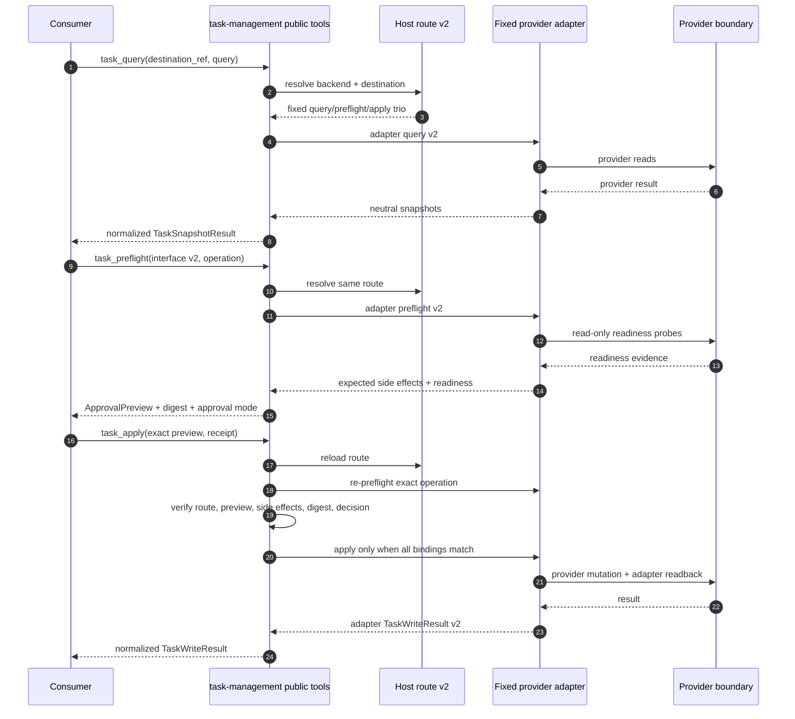

# Task Management Routing Flow

The public contract is unchanged when the host swaps adapters. The consumer
supplies only neutral task values and an opaque destination; the host route owns
adapter selection.

## Public sequence

Readiness is not approval. `confidence_authorized` is valid only when preflight
is ready, confidence-eligible, and certain. Human-required, uncertain, blocked,
or drifted operations stop before adapter apply.

## Ownership

| Layer | Owns | Must not accept/own |
| --- | --- | --- |
| Consumer | neutral query/operation, opaque destination, approval decision | tool name, config path, provider coordinate, credential |
| task-management | validation, route resolution, preview/digest, re-preflight, approval binding, normalization | provider mapping, raw MCP calls, mutable task store |
| Host route | fixed adapter trio and logical destination labels | task content, credentials |
| Provider adapter | provider mapping, pagination, mutation order, readback, safe partial/retry result | human approval decision, public tool selection |
| Provider/MCP host | auth, permissions, raw provider tools | public task contract |

## Test-only local seam

The test-only `local_json` read adapter exercises normalization with temporary
files. It is not an operator-facing runtime backend and never appears as a
normal runtime branch. There is no local write adapter.

## Retry boundary

Partial or unknown provider outcomes are nonretryable until a human inspects the
linked task. Only a typed result that explicitly confirms no write occurred may
return `retryable: true`.
