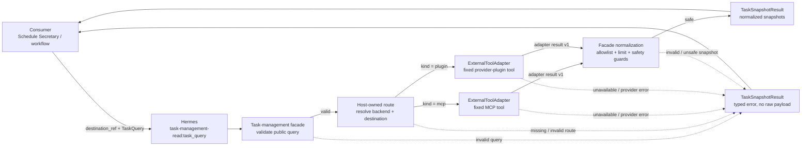
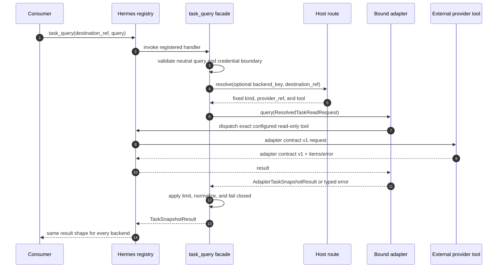
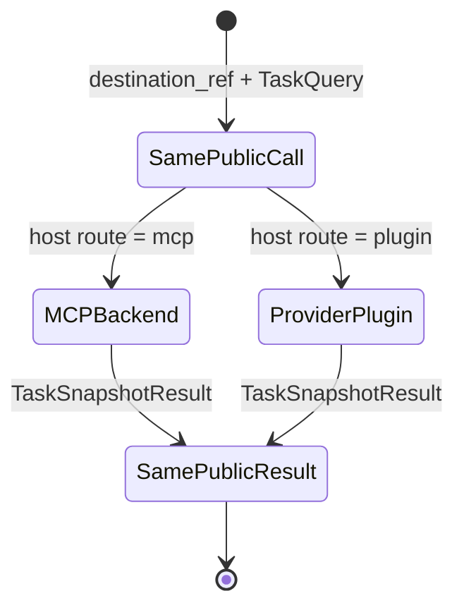
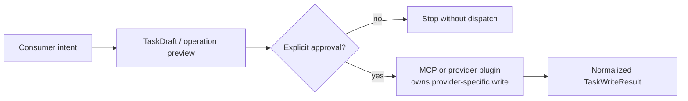

# Task Management Routing Flow

The public contract stays the same even when the host changes the task backend.
The caller supplies only a logical destination and backend-neutral filters. The
host route owns every provider-specific decision.

## Read Routing Overview

The two normal runtime backend branches rejoin before the response. Consumers
therefore never parse MCP or provider-plugin payloads directly.

## End-to-End Read Sequence

## Ownership at Each Hop

| Hop | Owner | May choose | Must not choose |
| --- | --- | --- | --- |
| Public request | Consumer | logical `destination_ref`, neutral filters, optional trusted `backend_key` | file path, provider tool, provider destination, credentials |
| Route resolution | Host configuration | default backend, adapter kind, fixed tool, opaque provider ref | task content or provider credentials |
| Adapter execution | External MCP/provider plugin | provider-specific read, internal pagination | public response shape |
| Public response | Task-management facade | canonical fields, public limit, typed error | raw IDs, unknown metadata, credentials, provider cursor |

## Backend Switch

Changing the backend is a host configuration change, not a consumer flow
change:

## Test and Smoke Fixture

The test-only `local_json` adapter exercises the same facade and normalization
contract with a temporary route and local JSON file. Only plugin-owned tests and
the isolated Hermes smoke use this seam; it is not part of the normal runtime
branches above, an operator bootstrap route, or a persistent task store.

## State-Changing Boundary

The diagrams above describe the implemented read path. A create, update,
comment, or report flow remains separate:

There is no local write adapter. The task-management plugin prepares the
backend-neutral review surface; the external backend owns authorization,
provider mutations, retries, and canonical mutable task state.
